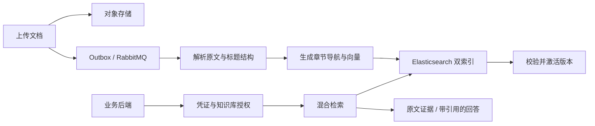

# DocQuery

**为业务系统提供可追溯的文档检索与问答 API。**

DocQuery 是基于 Java 的多租户知识库服务。上传 PDF、Word（DOCX）、文本或 Markdown 文档后，业务后端可以通过 HTTP API 检索原文，或生成带文档、章节和页码引用的回答。

项目包含文档处理管道、应用凭证与知识库授权、混合检索、受控问答和 Web 管理后台，适合为企业内部系统、客服平台、业务助手等应用接入文档知识。

[快速开始](#快速开始) · [启用检索与问答](#启用检索与问答) · [API 示例](#api-示例) · [开发与测试](#开发与测试) · [文档](#文档)

## 核心能力

| 能力 | 说明 |
| --- | --- |
| 多格式文档 | 支持 PDF、DOCX、TXT、Markdown；保留原文、标题结构和来源位置 |
| 混合检索 | 支持关键词检索、语义检索及两者融合，同时检索原文和章节导航信息 |
| 带引用的回答 | 在授权范围内检索、阅读证据并生成回答；证据不足时返回明确状态 |
| 多租户与应用授权 | 通过应用凭证访问指定知识库，校验租户、应用状态及知识库授权 |
| 文档版本管理 | 支持上传新版本、重建、失败重试和删除；新版本处理完成后才替换生效版本 |
| 异步处理 | 使用事务 Outbox、RabbitMQ、重试队列和死信队列处理文档任务 |
| 查询幂等与审计 | 支持 Redis 请求幂等，记录查询结果、错误、降级情况和追踪信息 |
| Web 管理后台 | 管理租户、应用、凭证、知识库、文档与任务，并提供问答、API 调试和审计查询 |

## 工作方式



原文件和派生内容保存在 S3 兼容对象存储中，MySQL 保存资源、版本与任务状态，Elasticsearch 保存可重建的检索索引。查询只使用已经完成处理并生效的文档版本。

问答由服务端限制工具调用范围、轮次、时间和证据预算，并校验返回引用。业务系统负责自己的最终用户登录与业务权限，DocQuery 负责应用到知识库的访问控制。

## 技术栈

| 层级 | 技术 |
| --- | --- |
| 后端 | Java 17、Spring Boot 4、MyBatis、Flyway |
| 管理后台 | React 19、TypeScript、Vite、Ant Design |
| 数据与检索 | MySQL、Elasticsearch、Redis |
| 文件与任务 | S3 兼容对象存储（默认 SeaweedFS）、RabbitMQ |
| 文档解析 | DeepDoc / RAGFlow，以及可选的本地格式解析器 |
| 模型接入 | LangChain4j；Chat 支持 Responses、Chat Completions 和 Anthropic 协议，Embedding 使用阿里云百炼适配器 |
| 测试 | JUnit、Testcontainers、Vitest、Playwright |

前端构建产物随 Spring Boot JAR 一起发布。运行打包后的应用不需要单独部署 Node.js 服务。

## 快速开始

以下步骤先启动管理后台，完成账号和资源配置。完整的文档入库、检索和问答需要继续配置[解析服务与模型](#启用检索与问答)。

### 1. 准备环境

- JDK 17。
- Node.js 24 与 npm，用于构建前端。
- Docker Engine / Docker Desktop，以及 Docker Compose。
- 使用 DeepDoc GPU 解析时，还需要 NVIDIA GPU 和容器 GPU 支持；也可以选择本地解析方式。

以下命令在项目根目录执行。Shell 示例使用 `sh ./mvnw`；Windows PowerShell 中将其替换为 `.\mvnw.cmd`。项目已包含 Maven Wrapper，无需另行安装 Maven。

```bash
git clone https://github.com/thcurse/DocQuery.git
cd DocQuery

docker compose up -d mysql seaweedfs rabbitmq elasticsearch redis
docker compose ps
```

等待依赖服务就绪。默认本地连接地址如下，端口和账号可通过 `compose.yaml` 中的 `DOCQUERY_*` 环境变量调整。

| 服务 | 默认地址 |
| --- | --- |
| MySQL | `localhost:3308` |
| SeaweedFS S3 | `localhost:8333` |
| RabbitMQ | `localhost:25672`，管理页面 `localhost:15672` |
| Elasticsearch | `localhost:19200` |
| Redis | `localhost:26379` |
| DeepDoc（另行启动） | `localhost:18080` |

### 2. 构建应用

```bash
sh ./mvnw -DskipTests package
```

构建会安装前端依赖、构建管理页面并打包 JAR。这里跳过 Java 测试以便首次启动；完整验证命令见[开发与测试](#开发与测试)。

### 3. 创建管理员并启动

首次运行时，在交互式终端中创建平台管理员：

```bash
java -jar target/docquery-0.0.1-SNAPSHOT.jar bootstrap-admin --login-name=platform.admin
```

按提示输入并确认密码。该命令仅用于数据库中尚无管理员的首次初始化，完成后会退出。

随后启动应用：

```bash
java -jar target/docquery-0.0.1-SNAPSHOT.jar
```

打开 [管理后台](http://localhost:8080/admin/)，使用刚创建的账号登录。平台管理员负责创建租户及租户管理员；租户管理员负责本租户的应用、知识库和文档。

停止本地依赖并保留数据：

```bash
docker compose stop
```

## 启用检索与问答

公共配置默认关闭真实模型调用、搜索投影和文档消费，以便在未配置模型时也能启动管理功能。完整链路需要同时准备解析服务、模型配置和处理开关。

### 1. 选择文档解析方式

**DeepDoc GPU 解析**是默认路径。首次使用需构建基础镜像和 HTTP 服务镜像：

```bash
docker compose --profile deepdoc-p0-gpu build deepdoc-p0-gpu
docker compose up -d --build deepdoc
```

通过 `http://localhost:18080/health/ready` 检查就绪状态。镜像构建会下载 RAGFlow 和 CUDA 相关依赖，具体配置见 [DeepDoc 服务说明](tools/deepdoc-service/README.md)。

**无 GPU 的本地开发**可以使用 PDFBox、Apache POI 等本地解析器。在下方配置的 `docquery` 节点中添加：

```yaml
parsing:
  deepdoc:
    enabled: false
```

此方式无需启动 DeepDoc 容器，适合先用 TXT、Markdown、DOCX 或带文本层的 PDF 验证流程；不提供 DeepDoc 的 OCR 能力。

### 2. 配置模型与处理链路

新建 `config/application-secrets.yml`。该文件已被 Git 忽略，并由应用从工作目录加载，不会打入 JAR。请从项目根目录启动应用。

下面展示配置结构。将示例中所有 `your-model-name` 替换为同一个实际模型名，并在启动应用的环境中设置所引用的 URL 和密钥。

```yaml
docquery:
  chat:
    profiles:
      your-model-name:
        model: your-model-name
        protocol: CHAT_COMPLETIONS
        base-url: ${DOCQUERY_CHAT_BASE_URL}
        api-key: ${DOCQUERY_CHAT_API_KEY}
  retrieval:
    provider-enabled: true
    chat-profile: your-model-name
    embedding-base-url: ${DOCQUERY_ALIBABA_EMBEDDING_BASE_URL}
    embedding-api-key: ${DASHSCOPE_API_KEY}
  search:
    enabled: true
  messaging:
    listener-enabled: true
  query:
    idempotency:
      enabled: true
    answer:
      chat-profile: your-model-name
```

Chat 模型需要支持工具调用和 JSON 输出，profile 的名称必须与 `model` 一致。也可以分别为检索卡生成和问答配置不同模型；协议可选 `RESPONSES`、`CHAT_COMPLETIONS` 或 `ANTHROPIC`，对应的 Base URL 需匹配所选服务。

Embedding 默认使用 `qwen3.7-text-embedding` 和 2,560 维向量，需配置相应的百炼接入地址与密钥。更换向量模型或维度时，需要同步检索配置并重建派生内容与索引。启用模型后，文档入库和问答会产生实际供应商调用。

修改配置后重启 Java 应用。完整参数见 [application.yml](src/main/resources/application.yml)。

### 3. 准备第一个知识库

使用租户管理员账号在后台完成以下操作：

1. 创建知识库并上传文档，等待文档版本变为 `READY`。
2. 创建应用，为应用生成 Credential，并保存创建时显示的完整凭证。
3. 为应用授予该知识库的 `READ` 或 `READ_WRITE` 权限。
4. 复制知识库 ID，通过后台“知识库问答”“API 调试”或业务后端发起请求。

默认单文件上传上限为 50 MiB。文档重建与版本更新均异步执行；处理完成前，已有生效版本继续提供查询。

## API 示例

两个服务接口使用相同的凭证与知识库授权：

| 接口 | 用途 |
| --- | --- |
| `POST /api/v1/service/knowledge-bases/{id}/retrieve` | 返回排序后的原文证据及来源位置 |
| `POST /api/v1/service/knowledge-bases/{id}/answer` | 返回基于证据的回答及引用 |

下面是业务后端发起问答的示例。将知识库 ID 替换为实际值，并通过环境变量提供 Credential：

```bash
curl --request POST \
  'http://localhost:8080/api/v1/service/knowledge-bases/1/answer' \
  --header "Authorization: Bearer ${DOCQUERY_CREDENTIAL}" \
  --header 'Idempotency-Key: expense-policy-001' \
  --header 'Content-Type: application/json' \
  --data '{"query":"差旅住宿报销标准是什么？","mode":"HYBRID","topK":5}'
```

将路径末尾的 `/answer` 改为 `/retrieve` 即可仅检索原文。`mode` 支持 `KEYWORD`、`SEMANTIC`、`HYBRID`，`topK` 范围为 1–20。每个新请求使用新的 `Idempotency-Key`，同一请求的超时重试复用原值。

问答结果可能为 `ANSWERED` 或 `INSUFFICIENT_EVIDENCE`。后者是证据不足的正常结果；调用方应展示该状态，而不是把它当作已有答案。成功响应中的 `X-DocQuery-Request-Id` 可用于审计查询和排障。

应用 Credential 应由业务后端保存，不应分发给最终用户的浏览器或移动端。完整请求、错误处理及客户端示例见 [API 接入说明](docs/api/外部服务API接入说明.md)，也可使用 [OpenAPI 定义](frontend/public/docs/docquery-service-api.openapi.yaml) 导入 API 工具。

## 开发与测试

完整构建与验证：

```bash
sh ./mvnw clean verify
```

该命令包含前端测试与构建、Java 单元测试，以及使用 Testcontainers 的集成测试。集成测试需要 Docker，并使用临时 MySQL、SeaweedFS、RabbitMQ、Elasticsearch 和 Redis，不连接本地 Compose 的业务数据。真实模型供应商测试默认跳过，需要显式配置后运行。

单独开发前端时，先启动 Java 后端，再执行：

```bash
cd frontend
npm ci
npm run dev
```

开发页面位于 `http://localhost:5173/admin/`，API 请求代理到 `localhost:8080`。前端测试和构建可分别运行 `npm test`、`npm run build`。

```text
src/main/java/          后端接口、业务服务、文档处理与检索
src/main/resources/     公共配置与数据库迁移
src/test/               Java 单元测试与集成测试
frontend/               管理后台
tools/deepdoc-service/  文档解析 HTTP 服务
tools/evaluation/       评测与复验脚本
evaluation/             评测样本定义与结果记录
docs/                   API、设计与开发文档
```

## 使用边界

- 项目仍在持续开发，公开评测记录用于说明特定样本与配置下的结果，不代表对所有文档的准确率承诺。复杂表格、扫描件和跨页内容建议使用自己的文档验证。
- 带引用的回答仍可能存在理解或推理错误，调用方应保留查看原文的入口。
- 管理后台包含问答调试页面；面向业务用户的会话、登录和权限由接入系统管理。
- `compose.yaml` 面向本地开发。部署到生产环境前应替换默认密码、限制依赖服务的网络暴露、启用 TLS 与必要的服务认证，并在 HTTPS 环境设置 `DOCQUERY_SESSION_COOKIE_SECURE=true`。

## 文档

- [API 接入说明](docs/api/外部服务API接入说明.md)
- [OpenAPI 定义](frontend/public/docs/docquery-service-api.openapi.yaml)
- [管理后台功能说明](docs/product/02-DocQuery-管理后台页面说明-v0.1.md)
- [文档检索与异步处理设计](docs/technical-decisions/02-文档检索与异步处理技术选型.md)
- [工程分层约定](docs/development/01-工程代码分层规范.md)
- [DeepDoc 服务说明](tools/deepdoc-service/README.md)
- [评测样本与记录](evaluation/)

## 反馈与贡献

欢迎通过 [Issues](https://github.com/thcurse/DocQuery/issues) 提交问题、使用反馈或功能建议，也欢迎提交 Pull Request。

报告问题时，请提供复现步骤、运行环境和脱敏后的错误信息。涉及文档解析或检索时，尽量附上可以公开的最小文档样例。修改代码时，请为行为变化补充相应测试；涉及 API 或配置变化时，一并更新文档。

## 许可证

仓库目前尚未提供 `LICENSE` 文件，许可证信息待补充。
