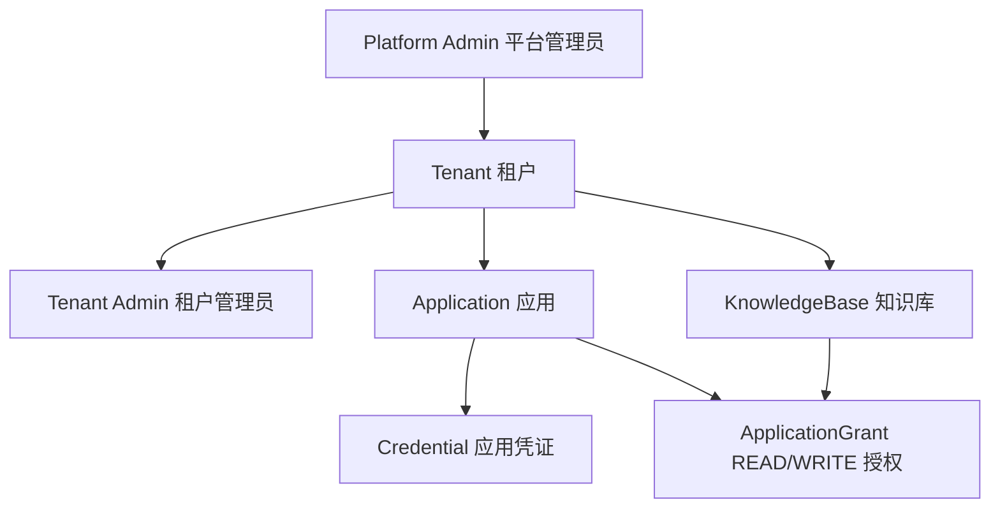

# DocQuery N1 身份与授权设计

> 当前阶段：N1 身份与授权里程碑已完成；N2.1 已完成并经用户验收  
> 状态：N1.1至N1.7均已完成，用户于2026-08-01确认N1.7总体验收完成；检索与入库路线及 N2 技术选型已形成文档，N2 继续按子阶段单独确认  
> 文档范围：N1 设计决定、实际落地记录和分阶段验收证据

## 1. 文档目的

本文档把产品文档中的 N1 要求收敛为后续可以逐步实现和验收的设计约束。

N1 要解决的不是“如何检索”，而是两个更基础的问题：

1. 当前是谁在调用 DocQuery？
2. 这个调用者能否访问指定知识库？

本文档是 N1 的实现依据，但不替代以下产品基线：

- [`01-DocQuery-产品设计-v0.1.md`](../product/01-DocQuery-产品设计-v0.1.md)
- [`02-DocQuery-管理后台页面说明-v0.1.md`](../product/02-DocQuery-管理后台页面说明-v0.1.md)
- [`03-DocQuery-新服务开发计划-v0.1.md`](../product/03-DocQuery-新服务开发计划-v0.1.md)

发生冲突时，先停止实现并更新文档，不允许只修改代码。

## 2. N1 对外结果

N1 完成后，管理员能够：

1. 使用本地管理员账号登录管理 API。
2. 创建和停用租户。
3. 在租户内创建应用和知识库。
4. 为应用生成只展示一次的凭证。
5. 给应用授予、修改或撤销某个知识库的 `READ`、`WRITE` 或 `READ_WRITE` 权限。
6. 轮换和撤销应用凭证。

系统能够：

1. 根据应用凭证解析出应用和租户。
2. 判断应用能否访问一个明确指定的知识库。
3. 在租户、应用、知识库、凭证或授权失效后立即拒绝新访问。
4. 阻止跨租户授权和跨租户访问。

N1 不提供检索结果，也不创建用于演示鉴权的假业务接口。应用凭证解析和授权判断通过服务组件及集成测试验收。

## 3. 范围与非目标

### 3.1 本阶段范围

- 首个平台管理员的部署期创建
- 本地管理员账号
- 管理员登录身份与租户范围
- Tenant
- Application
- Credential
- KnowledgeBase
- ApplicationGrant
- 应用凭证解析
- `READ`、`WRITE` 和 `READ_WRITE` 授权判断
- 启用、停用、撤销和轮换
- 管理 API 契约
- 数据库约束和集成测试

### 3.2 明确不做

- 管理后台前端
- 企业 SSO
- 传统业务系统的终端用户、部门、角色和业务对象权限
- 知识库内的文档、版本和处理任务
- 上传、解析、检索卡生成、Embedding、检索和问答
- RabbitMQ、Elasticsearch、MinIO、Redis 和文档处理消费者
- 应用管理知识库配置或其他应用的授权
- 文档级 ACL
- 一次访问多个知识库
- 根据问题内容自动选择知识库
- 应用凭证由浏览器直接持有
- 完整访问审计查询
- 资源物理删除
- 凭证自动到期和专用的原子轮换接口
- 独立的“接入开发者”管理角色
- 额外租户管理员邀请、密码重置和管理员跨租户成员关系

## 4. 调用者与信任边界

N1 区分两类完全不同的身份。

### 4.1 管理员身份

管理员调用管理 API，负责创建和管理租户、应用、凭证、知识库与授权。

第一版采用本地管理员账号，不接企业 SSO。

管理员身份不能作为服务 API 的应用凭证使用。

### 4.2 应用身份

Application 表示接入 DocQuery 的传统业务后端，例如：

- `work-order-production`
- `crm-production`
- `customer-service-testing`

应用通过 Credential 调用服务 API。

应用不是管理员，也不是传统业务系统中的终端用户。

应用凭证不能调用管理 API。

### 4.3 传统业务系统仍然负责

- 终端用户注册、登录和注销
- 部门、岗位和业务角色
- 工单、订单和客户数据权限
- 当前用户能否使用知识查询
- 根据业务场景选择本次目标知识库

DocQuery 只保证：

> 一个应用不能访问未授权知识库。

## 5. 资源关系



N1 的业务资源只有 Tenant、AdminUser、Application、Credential、KnowledgeBase 和 ApplicationGrant。管理员会话属于身份验证的临时技术状态，不属于产品资源。

## 6. 管理员身份设计

### 6.1 管理员角色

N1 实现两个角色：

| 数据库存储代码 | 角色 | 范围 | 能力 |
| --- | --- | --- | --- |
| `"1"` | `PLATFORM_ADMIN` | 全平台 | 创建、查看、启用和停用租户 |
| `"2"` | `TENANT_ADMIN` | 单个租户 | 管理本租户的应用、凭证、知识库和授权 |

产品设计中的 `KNOWLEDGE_BASE_ADMIN` 暂不在 N1 实现，因为文档管理尚未开始。引入该角色前必须单独设计它与知识库的绑定关系。

“接入开发者”在 N1 中是拿到凭证并完成业务系统接入的人，不是 DocQuery 管理角色。凭证生成和授权仍由租户管理员完成。

### 6.2 本地管理员账号

管理员账号至少包含：

| 字段 | 含义 |
| --- | --- |
| `id` | 内部稳定标识 |
| `tenant_id` | 租户管理员所属租户；平台管理员为空 |
| `login_name` | 小写 ASCII 登录名，全局唯一且不可修改 |
| `password_hash` | 密码哈希，不保存明文 |
| `role` | 字符串代码：`"1"` = `PLATFORM_ADMIN`，`"2"` = `TENANT_ADMIN` |
| `status` | 字符串代码：`"1"` = `ACTIVE`，`"2"` = `DISABLED` |
| `created_at` / `updated_at` | 创建和更新时间 |

约束：

- `PLATFORM_ADMIN` 的 `tenant_id` 必须为空。
- `TENANT_ADMIN` 的 `tenant_id` 必须存在。
- `login_name` 去除首尾空格后转为小写，格式为 `[a-z0-9][a-z0-9._-]{2,63}`。
- 管理员被停用后，新请求立即失效。
- 密码使用 Spring Security `DelegatingPasswordEncoder` 支持的自适应单向算法，编码结果保留算法标识，初始实现使用 bcrypt。
- N1.3a 默认 bcrypt 工作因子为 `12`，可通过 `DOCQUERY_BCRYPT_STRENGTH` 调整；部署到不同硬件后仍需实测安全成本与登录延迟。
- 管理员密码至少 12 个字符，并且 UTF-8 编码后最多 72 字节；这是 bcrypt 的有效输入边界，创建和登录使用同一规则。
- 密码、密码哈希、Session ID 和 CSRF Token 不得写入日志。

### 6.3 首个平台管理员的部署期创建

本地账号模式必须解决“还没有管理员时，谁来创建第一个管理员”的问题，但这不是管理后台中的产品功能。

N1 不提供首次初始化页面，也不提供公开的 `/bootstrap` HTTP 接口。部署人员通过一次性命令创建首个平台管理员：

```text
java -jar docquery.jar bootstrap-admin --login-name=<name>
```

规则：

- 命令通过交互式终端读取并再次确认密码，密码不出现在命令参数、配置文件或日志中。
- 命令以非 Web 模式启动，只执行创建操作并退出。
- 只有数据库中不存在任何 AdminUser 时才允许执行。
- 命令只创建一个 `PLATFORM_ADMIN`，不创建 Tenant 或 `TENANT_ADMIN`。
- 已存在管理员时命令失败，不修改任何数据。
- 部署人员不得并发执行该命令；N1 不为一次性运维操作增加 `platform_state` 或分布式锁。
- 首个平台管理员随后通过正常管理 API 创建第一个 Tenant 及其首个 `TENANT_ADMIN`。

### 6.4 管理员登录与 Session

管理员提交登录名和密码后，Spring Security 使用 `PasswordEncoder` 验证密码，并通过标准 `HttpSession` 保存登录状态。浏览器只保存随机的 `JSESSIONID` Cookie：

```text
账号和密码
  -> PasswordEncoder 验证
  -> 服务端 HttpSession
  -> 浏览器 JSESSIONID Cookie
```

N1 的具体规则：

- Session 保存在当前单体服务的 JVM 内存中，不创建 `admin_session` 数据表。
- 浏览器后续请求自动携带 `JSESSIONID`；管理 API 不接收自定义 `dq_admin` Bearer Token。
- Cookie 设置 `HttpOnly` 和 `SameSite=Lax`；生产 HTTPS 环境必须设置 `Secure`。
- 登录成功后更换 Session ID，避免 Session Fixation。
- 连续 8 小时没有任何请求后 Session 失效；任一正常请求会重新计算空闲时间。不提供前端保活心跳、Remember Me 或 Refresh Token。
- 服务重启后内存 Session 丢失，管理员重新登录；N1 接受这一限制。
- 登出立即使当前 Session 失效并清除 Cookie。
- N1 不限制同一管理员在多个浏览器中同时登录。
- 所有修改状态的管理请求启用 Spring Security CSRF 防护；客户端先获取 CSRF Token，再通过请求 Header 提交。
- 登录成功时同时更换 Session ID 并清除登录前的 CSRF Token；客户端随后必须重新获取 Token，才能登出或执行其他修改请求。
- 每次管理请求重新检查 AdminUser 状态，以及租户管理员所属 Tenant 的状态；账号或租户停用后已有 Session 的新请求立即失败。
- 管理员 Session 和应用凭证使用不同鉴权入口；Session 不能调用服务 API，应用凭证不能调用管理 API。

管理员会话属于技术实现，不扩大产品对象范围，也不作为数据库业务对象。
管理员通过会话解析出角色和固定租户范围。除租户管理接口外，平台管理员不自动继承租户内部的应用、凭证、知识库和 Grant 管理权限。

### 6.5 非当前路线：OIDC 知识扩展

本个人项目没有企业身份提供方，OIDC 不属于当前版本，也不列入确定的后续开发路线。这里只保留面试时用于说明技术边界的假设：如果未来部署方已经拥有统一身份系统，管理员认证入口可以替换，而业务授权模型不必推翻。

- 假设部署方已有企业身份提供方，可由其通过 OIDC 完成密码、MFA 或 Passkey 验证。
- DocQuery 作为 OIDC Client 校验返回结果，再映射本地管理员及其租户范围。
- 登录成功后仍可创建本项目的 `HttpSession`，后续授权规则不变。
- DocQuery 不自行实现 OAuth/OIDC Authorization Server。
- 当前实际实现始终是本地密码登录；不会为了展示技术而部署 Keycloak、Auth0 或其他 IdP。

## 7. 业务对象设计

本节保留业务逻辑模型，N1.2 的实际数据库映射和验证证据记录在第 21 节。

### 7.0 标识与规范化约定

- Tenant、AdminUser、Application、Credential、KnowledgeBase 和 ApplicationGrant 都使用独立稳定 ID。
- N1 使用 MySQL `BIGINT AUTO_INCREMENT` 主键，Java 使用 `Long` 表达；全部逻辑关联 ID 同样使用 `BIGINT`。
- 当前单体和单库阶段不引入 UUID、雪花算法或额外的公开 ID。对外接口不能依赖 ID 难猜来实现安全性，仍必须执行租户和授权校验。
- 名称、Application code、Credential keyId 和 Secret 哈希都不能代替资源 ID。
- Application code 在写入前去除首尾空格并转为小写，创建后不可修改。
- Application code 采用 `[a-z0-9][a-z0-9-]{2,63}`。
- KnowledgeBase name 去除首尾空格后不能为空；同租户唯一性按规范化后的精确字符比较，英文大小写敏感。
- Application environment 固定为 `DEVELOPMENT`、`TESTING`、`PRODUCTION`。
- 权限、状态和管理员角色在数据库、Entity、DTO 与 VO 中使用 `VARCHAR` 字符串数字代码；数字只作为枚举代码，不进行位运算。
- 通用状态代码固定为 `"1"` = `ACTIVE`、`"2"` = `DISABLED`、`"3"` = `REVOKED`；不同字段只接受其文档明确列出的子集。

### 7.1 Tenant

| 字段 | 含义 |
| --- | --- |
| `id` | 内部稳定标识 |
| `name` | 租户名称 |
| `status` | `"1"` = `ACTIVE`，`"2"` = `DISABLED` |
| `created_at` / `updated_at` | 创建和更新时间 |

规则：

- 停用租户后，其管理员、应用凭证和知识库访问立即失效。
- 停用不删除应用、知识库、凭证和授权记录。
- N1 不支持跨租户共享。

### 7.2 Application

| 字段 | 含义 |
| --- | --- |
| `id` | 内部稳定标识 |
| `tenant_id` | 所属租户 |
| `code` | 应用代码 |
| `name` | 展示名称 |
| `environment` | `DEVELOPMENT`、`TESTING` 或 `PRODUCTION` |
| `description` | 可选说明 |
| `status` | `"1"` = `ACTIVE`，`"2"` = `DISABLED` |
| `created_at` / `updated_at` | 创建和更新时间 |

规则：

- `(tenant_id, code)` 唯一。
- `code` 按 7.0 的规则规范化且不可修改。
- 生产和测试环境使用不同 Application。
- 停用应用后，该应用的全部凭证立即失效。
- 停用不删除历史凭证和授权。
- Application 允许重新启用；重新启用后，未撤销的 Credential 和 `ACTIVE` Grant 会重新生效。
- 如果停用原因是凭证泄露，管理员必须在重新启用前撤销旧凭证。
- N1 不提供物理删除应用的接口。

### 7.3 KnowledgeBase

| 字段 | 含义 |
| --- | --- |
| `id` | 服务 API 使用的稳定知识库标识 |
| `tenant_id` | 所属租户 |
| `name` | 知识库名称 |
| `description` | 可选说明 |
| `status` | `"1"` = `ACTIVE`，`"2"` = `DISABLED` |
| `created_at` / `updated_at` | 创建和更新时间 |

规则：

- `(tenant_id, name)` 唯一。
- 停用知识库后，新服务访问立即失败。
- 停用不删除授权和未来的文档数据。
- N1 不提供物理删除知识库的接口。

### 7.4 Credential

| 字段 | 含义 |
| --- | --- |
| `id` | 内部标识 |
| `application_id` | 所属应用 |
| `name` | 管理员可理解的凭证名称 |
| `key_id` | 凭证查找标识，全局唯一 |
| `secret_digest` | 32 字节 SHA-256 摘要 |
| `status` | `"1"` = `ACTIVE`，`"3"` = `REVOKED` |
| `created_at` | 创建时间 |
| `last_used_at` | 最近一次成功使用时间，可为空 |
| `revoked_at` | 撤销时间，可为空 |
| `created_by` / `revoked_by` | 执行操作的管理员 |

规则：

- 数据库不保存完整凭证或 Secret 明文。
- 同一应用最多同时存在两把 `ACTIVE` 凭证，用于轮换。
- 撤销一把凭证不影响同一应用的其他有效凭证。
- 已撤销凭证不能恢复；需要重新生成。
- 凭证记录不物理删除。
- N1 凭证没有自动到期时间，只通过主动撤销失效。

### 7.5 ApplicationGrant

| 字段 | 含义 |
| --- | --- |
| `id` | 内部标识 |
| `tenant_id` | 授权所属租户 |
| `application_id` | 被授权应用 |
| `knowledge_base_id` | 目标知识库 |
| `permission` | `"1"` = `READ`，`"2"` = `WRITE`，`"3"` = `READ_WRITE` |
| `status` | `"1"` = `ACTIVE`，`"3"` = `REVOKED` |
| `granted_at` | 当前这次授权时间 |
| `granted_by` | 当前这次授权管理员 |
| `revoked_at` | 最近一次撤销时间，可为空 |
| `revoked_by` | 最近一次撤销管理员，可为空 |

规则：

- `(application_id, knowledge_base_id)` 唯一。
- `READ_WRITE` 是单独定义的字符串枚举值，不是位掩码；需要 `READ` 时接受 `READ` 或 `READ_WRITE`，需要 `WRITE` 时接受 `WRITE` 或 `READ_WRITE`。
- Application 和 KnowledgeBase 必须属于同一 `tenant_id`。
- 只能给当前租户下启用的应用和知识库新增授权。
- 撤销授权后，新访问立即失败。
- 撤销授权不影响该应用的其他知识库授权。
- 撤销时把 Grant 标记为 `REVOKED`，不物理删除。
- 对同一组合重新授权时复用该 Grant，更新 `granted_at/granted_by`，清空 `revoked_at/revoked_by` 并改为 `ACTIVE`。
- 完整的多次变更历史由后续审计记录保存。

## 8. 数据库约束与逻辑外键

DocQuery 遵循不使用物理外键的工程约定。所有 `tenant_id`、`application_id`、`knowledge_base_id` 和管理员 ID 都是逻辑外键：

- Flyway DDL 不创建 `FOREIGN KEY`。
- 六张 N1 表的每一个字段都必须具有 MySQL `COLUMN_COMMENT`；权限、状态和角色字段的备注必须写明每个字符串数字代码的含义。
- 不使用 `CASCADE DELETE` 或其他数据库级联操作。
- 关联存在性、资源归属和跨租户校验由 Mapper 查询和 Service 事务完成。
- 数据库只保留字段类型、主键、`NOT NULL`、必要的唯一索引和普通查询索引。
- 状态枚举、角色与 `tenant_id` 组合、时间字段组合等业务语义不使用 `CHECK`，统一由 Java 业务代码校验。

N1.2 的数据库迁移至少需要：

| 约束 | 目的 |
| --- | --- |
| `admin_user.login_name` 全局唯一 | 避免账号歧义 |
| `application(tenant_id, code)` 唯一 | 同一租户应用代码不重复 |
| `knowledge_base(tenant_id, name)` 唯一 | 同一租户知识库名称不重复 |
| `credential.key_id` 全局唯一 | 通过前缀直接定位凭证 |
| `application_grant(application_id, knowledge_base_id)` 唯一 | 避免重复授权 |
| 逻辑外键列建立普通索引 | 支持按租户和父资源查询 |

唯一索引不是业务校验的替代。Service 仍需先检查并返回明确错误；数据库唯一索引负责封住两个并发事务同时通过“数据不存在”检查后的竞态。

`ApplicationGrant` 仍保存 `tenant_id`，但它不是物理外键。N1.6 的授权业务代码必须在同一事务中：

```text
从已认证管理员取得 tenantId
→ 按 (tenantId, applicationId) 查询 Application
→ 按 (tenantId, knowledgeBaseId) 查询 KnowledgeBase
→ 检查两者均存在且为 ACTIVE
→ 写入同一个 tenantId 的 ApplicationGrant
```

跨租户 Grant 属于业务授权问题，不作为 N1.2 数据库约束验收项。N1.6 必须通过 Service 集成测试证明跨租户请求失败且数据库没有新增 Grant。

由于数据库不会替业务代码兜底，所有写入必须经过受控 Mapper 和 Service；N1 不提供物理删除，避免删除父记录产生孤儿数据。未来若引入数据导入、修复脚本或物理删除，必须同时提供关联一致性检查。

## 9. 应用凭证设计

### 9.1 凭证格式

完整凭证建议采用：

```text
dq_app_<keyId>.<secret>
```

- `keyId` 用于查询 Credential 记录，不属于秘密。
- `secret` 使用 `SecureRandom` 生成至少 256 位随机值。
- 两部分均使用 URL-safe 编码。
- 日常管理页面只显示凭证名称和 `keyId` 摘要。

### 9.2 创建

创建凭证的事务流程：

1. 锁定目标 Application。
2. 验证 Tenant 和 Application 均为 `ACTIVE`。
3. 检查当前 `ACTIVE` 凭证数量小于 2。
4. 生成 `keyId` 和随机 Secret。
5. 计算并保存 Secret 哈希。
6. 提交事务。
7. 只在本次响应中返回完整凭证。

完整凭证不得出现在：

- 数据库
- 日志
- 异常消息
- 后续查询响应
- 示例配置
- 测试快照

### 9.3 Secret 摘要

应用 Secret 由 `SecureRandom` 生成至少 256 位随机值，不是用户选择的低熵密码。N1 保存：

```text
secret_digest = SHA-256(secret)
```

要求：

- 数据库字段固定为 32 字节摘要。
- 验证时重新计算摘要，并使用 `MessageDigest.isEqual` 比较。
- 数据库泄露者不能把摘要直接作为凭证使用。
- 如果未来需要更换摘要方案，只能通过生成新凭证并轮换完成，不能在没有 Secret 明文时原地重算。
- 任何认证日志只记录 `keyId` 摘要，不记录 Secret 或完整摘要。

### 9.4 解析与验证

一次应用访问按以下顺序判断：

```text
凭证格式是否合法
→ keyId 是否存在
→ Secret 哈希是否匹配
→ Credential 是否 ACTIVE
→ Tenant 是否 ACTIVE
→ Application 是否 ACTIVE
→ KnowledgeBase 是否属于该 Tenant
→ KnowledgeBase 是否 ACTIVE
→ 是否存在 READ Grant
→ 允许或拒绝
```

服务请求不能携带或覆盖 `tenantId`。租户身份只从已验证 Credential 对应的 Application 推导。

正式服务 API 预计也使用 `Authorization: Bearer <dq_app_...>`，但最终 HTTP 契约在 N3 冻结。N1 只冻结凭证格式和内部认证行为。

### 9.5 轮换

轮换流程：

```text
生成第二把凭证
→ 业务系统部署新凭证
→ 验证新凭证可用
→ 撤销旧凭证
```

N1 不自动撤销旧凭证，由管理员明确完成切换。第三把有效凭证创建请求返回 `409 ACTIVE_CREDENTIAL_LIMIT_REACHED`。

### 9.6 立即失效

N1 不缓存以下正向鉴权结果：

- Credential 状态
- Application 状态
- Tenant 状态
- KnowledgeBase 状态
- ApplicationGrant

因此撤销、停用或撤权后的下一次请求直接读取最新数据库状态并失败。后续如引入缓存，必须单独设计失效机制并重新验证“立即失效”。

## 10. 授权判断组件

N1 后端需要形成两个独立组件：

### 10.1 `ApplicationCredentialResolver`

输入：

- 完整应用凭证

输出：

- 已验证的 `applicationId`
- 已验证的 `tenantId`
- `credentialId`

它不接受调用方传入的租户身份。

### 10.2 `KnowledgeBaseAccessAuthorizer`

输入：

- 已验证的应用上下文
- 明确的 `knowledgeBaseId`
- 所需权限：`READ` 或 `WRITE`

输出：

- 允许访问的知识库上下文
- 或结构化拒绝原因

N1 不为了演示这两个组件创建 `/test-auth`、`/check-permission` 等临时公开接口。行为通过组件测试和真实数据库集成测试证明，N3 的正式检索 API 再调用它们。

## 11. 管理 API 草案

统一前缀：

```text
/api/admin/v1
```

### 11.1 登录

| 方法 | 路径 | 用途 |
| --- | --- | --- |
| `GET` | `/auth/csrf` | 获取登录和修改请求所需的 CSRF Token |
| `POST` | `/auth/login` | 验证管理员密码并创建 HttpSession |
| `POST` | `/auth/logout` | 使当前 HttpSession 失效并清除 Cookie |
| `GET` | `/auth/me` | 返回当前管理员、角色和租户范围 |

`/auth/csrf` 和 `/auth/login` 允许未登录访问，其他管理接口均要求有效 Session。登录以及所有修改状态的请求必须携带 CSRF Token。

N1.3b 实际 JSON 契约：

```text
GET /api/admin/v1/auth/csrf
200 {"headerName":"X-CSRF-TOKEN","parameterName":"_csrf","token":"<token>"}

POST /api/admin/v1/auth/login
X-CSRF-TOKEN: <token>
{"loginName":"platform.admin","password":"<password>"}

200 {"id":1,"loginName":"platform.admin","role":"1","tenantId":null}

GET /api/admin/v1/auth/me
200 {"id":1,"loginName":"platform.admin","role":"1","tenantId":null}

POST /api/admin/v1/auth/logout
X-CSRF-TOKEN: <登录后重新获取的 token>
204 No Content
```

调用顺序：

1. 未登录客户端调用 `/auth/csrf`，取得 Token 和登录前 Session。
2. 调用 `/auth/login` 时同时携带该 Session Cookie 和 `X-CSRF-TOKEN`。
3. 登录成功后 Session ID 被更换，登录前 Token 被清除。
4. 客户端再次调用 `/auth/csrf`，取得登录后 Token。
5. 后续登出以及其他修改请求携带登录后 Token。

认证失败统一返回 `401 AUTHENTICATION_FAILED`，不区分账号不存在、密码错误、账号停用或租户停用。未登录访问受保护接口返回 `401 UNAUTHENTICATED`；CSRF 缺失或错误返回 `403 ACCESS_DENIED`。生产环境密码只能通过 HTTPS 传输。

### 11.2 租户

| 方法 | 路径 | 角色 |
| --- | --- | --- |
| `POST` | `/tenants` | 平台管理员创建租户及其首个租户管理员 |
| `GET` | `/tenants` | 平台管理员查看租户 |
| `GET` | `/tenants/{tenantId}` | 平台管理员或所属租户管理员查看 |
| `PATCH` | `/tenants/{tenantId}` | 平台管理员修改名称或状态 |

创建 Tenant 的请求同时包含 `tenantName`、`adminLoginName` 和 `adminPassword`。Tenant 与首个 `TENANT_ADMIN` 必须在同一事务中成功或回滚；密码只进入 PasswordEncoder，不进入响应和日志。

N1.3c 冻结以下实际契约，统一前缀为 `/api/admin/v1`：

```text
POST /tenants
X-CSRF-TOKEN: <登录后的 token>
{
  "tenantName": "Acme Support",
  "adminLoginName": "acme.admin",
  "adminPassword": "<password>"
}

201 {
  "tenant": {
    "id": 1,
    "name": "Acme Support",
    "status": "1",
    "createdAt": "2026-08-01T01:00:00Z",
    "updatedAt": "2026-08-01T01:00:00Z"
  },
  "initialAdmin": {
    "id": 2,
    "loginName": "acme.admin",
    "role": "2",
    "status": "1",
    "tenantId": 1
  }
}

GET /tenants?page=0&size=20
200 {
  "items": [<tenant>],
  "page": 0,
  "size": 20,
  "total": 1
}

GET /tenants/{tenantId}
200 <tenant>

PATCH /tenants/{tenantId}
X-CSRF-TOKEN: <登录后的 token>
{"name":"Acme Support CN","status":"2"}
200 <tenant>
```

字段与行为规则：

- Tenant 名称去除首尾空格后长度为 1 到 200 个字符。产品和数据库没有定义 Tenant 名称唯一，因此允许重名，以稳定 ID 区分。
- `createdAt` 和 `updatedAt` 使用带 `Z` 的 ISO-8601 UTC 时间，避免客户端猜测服务器时区。
- Tenant 和首个 `TENANT_ADMIN` 初始状态均为 `ACTIVE`；管理员登录名和密码复用 N1.3a/N1.3b 已确认规则。
- `POST /tenants` 和列表只允许 `PLATFORM_ADMIN`；`PATCH` 也只允许 `PLATFORM_ADMIN`。
- `GET /tenants/{tenantId}` 允许平台管理员查看任意 Tenant，允许租户管理员查看自己的 Tenant；租户管理员修改路径 ID 访问其他 Tenant 时返回 `403 TENANT_SCOPE_FORBIDDEN`。
- 列表 `page` 从 0 开始且不得为负数；`size` 为 1 到 100，默认 20；结果按 Tenant ID 升序，返回总数。
- PATCH 至少提供 `name` 或 `status` 之一；`status` 只接受 `"1"`（启用）、`"2"`（停用）。相同值重复提交允许成功。
- Tenant 不存在返回 `404 TENANT_NOT_FOUND`；请求字段不合法返回 `400 VALIDATION_FAILED`；首个管理员登录名冲突返回 `409 ADMIN_LOGIN_CONFLICT`。
- 创建事务先由业务代码检查登录名，再插入 Tenant 和 AdminUser。数据库全局登录名唯一索引只作为并发冲突兜底；AdminUser 插入失败时 Tenant 必须回滚。
- 本阶段继续使用逻辑外键，不新增数据库迁移、物理外键或 `CHECK`。

### 11.3 应用

| 方法 | 路径 | 用途 |
| --- | --- | --- |
| `POST` | `/tenants/{tenantId}/applications` | 创建应用 |
| `GET` | `/tenants/{tenantId}/applications` | 查看应用 |
| `GET` | `/tenants/{tenantId}/applications/{applicationId}` | 查看应用详情 |
| `PATCH` | `/tenants/{tenantId}/applications/{applicationId}` | 修改信息或状态 |

### 11.4 应用凭证

| 方法 | 路径 | 用途 |
| --- | --- | --- |
| `POST` | `/tenants/{tenantId}/applications/{applicationId}/credentials` | 生成凭证并一次性返回完整值 |
| `GET` | `/tenants/{tenantId}/applications/{applicationId}/credentials` | 查看凭证摘要 |
| `DELETE` | `/tenants/{tenantId}/applications/{applicationId}/credentials/{credentialId}` | 幂等撤销凭证，记录保留 |

#### N1.5 冻结契约

N1.5 的 Credential 管理接口统一使用 `/api/admin/v1` 前缀，实际 JSON 和 HTTP 行为冻结如下：

```text
POST /tenants/{tenantId}/applications/{applicationId}/credentials
X-CSRF-TOKEN: <登录后的 token>
{"name":"2026-08 生产环境轮换"}

201 Created
Location: /api/admin/v1/tenants/{tenantId}/applications/{applicationId}/credentials/{credentialId}
Cache-Control: no-store
Pragma: no-cache
{
  "id": 21,
  "applicationId": 8,
  "name": "2026-08 生产环境轮换",
  "keyIdPrefix": "AbCdEf12",
  "credential": "dq_app_<keyId>.<secret>",
  "status": "1",
  "createdAt": "2026-08-01T02:00:00Z"
}

GET /tenants/{tenantId}/applications/{applicationId}/credentials?page=0&size=20
200 {
  "items": [{
    "id": 21,
    "applicationId": 8,
    "name": "2026-08 生产环境轮换",
    "keyIdPrefix": "AbCdEf12",
    "status": "1",
    "createdAt": "2026-08-01T02:00:00Z",
    "lastUsedAt": null,
    "revokedAt": null
  }],
  "page": 0,
  "size": 20,
  "total": 1
}

DELETE /tenants/{tenantId}/applications/{applicationId}/credentials/{credentialId}
X-CSRF-TOKEN: <登录后的 token>
204 No Content
```

接口和权限规则：

- 三个接口只允许所属租户的 `TENANT_ADMIN`；平台管理员不能代管租户内部凭证。可信 Tenant 范围来自 `AdminPrincipal`，路径 Tenant ID 只作为待校验资源范围。
- 路径 Tenant ID 超出管理员范围返回 `403 TENANT_SCOPE_FORBIDDEN`。当前路径范围正确但 Application 或 Credential 实际属于其他租户或应用时返回 `404`，不泄露资源存在性。
- Credential 名称去除首尾空格后为 1 到 200 个 Unicode 字符；空白或超长返回 `400 VALIDATION_FAILED`。
- 列表默认 `page=0`、`size=20`，`size` 最大 100，按 Credential ID 降序展示最新记录；包含 `ACTIVE` 和 `REVOKED` 历史。
- 创建要求 Tenant 和 Application 均为 `ACTIVE`。Application 停用时创建返回 `409 APPLICATION_NOT_ACTIVE`；查看和撤销仍允许在 Application 停用时执行，便于管理员在重新启用前清理旧凭证。
- 同一 Application 最多同时存在两把 `ACTIVE` Credential。创建事务必须锁定目标 Application 后再计数；第三把返回 `409 ACTIVE_CREDENTIAL_LIMIT_REACHED`。
- N1.5 不提供专用轮换接口。轮换固定为“创建第二把 -> 业务后端验证新凭证 -> 幂等撤销旧凭证”。撤销记录保留且不可恢复；重复 `DELETE` 返回相同的 `204`，不覆盖首次撤销人和撤销时间。
- Application 不存在返回 `404 APPLICATION_NOT_FOUND`，Credential 不存在返回 `404 CREDENTIAL_NOT_FOUND`。Credential ID 必须同时受 Application ID 约束。

Secret 与认证规则：

- `keyId` 使用 `SecureRandom` 生成 128 位随机值，Secret 使用 `SecureRandom` 生成 256 位随机值；两者均使用不带填充的 URL-safe Base64。
- 完整值固定为 `dq_app_<keyId>.<secret>`。数据库只保存全局唯一 `key_id` 和 `SHA-256(secret)` 的 32 字节二进制摘要，不保存完整凭证或 Secret 明文。
- Secret 摘要比较使用 `MessageDigest.isEqual`。未知 `keyId`、错误 Secret 和格式错误在内部统一表现为无效凭证，错误消息不得包含输入值。
- 完整 `credential` 只存在于创建成功的这一次响应。后续列表只返回 8 字符 `keyIdPrefix`；不返回完整 `keyId`、完整凭证、Secret、`secret_digest`、`created_by` 或 `revoked_by`。
- 创建响应必须禁止缓存。完整凭证不得写入日志、异常、数据库、Location、测试快照或示例配置。
- N1.5 实现内部 `ApplicationCredentialResolver`，正确凭证解析为可信的 `credentialId`、`applicationId` 和 `tenantId`；不接受调用方提供 Tenant ID，也不创建临时 HTTP 鉴权接口。
- Resolver 每次读取 Credential、Application 和 Tenant 当前状态，不缓存正向结果。撤销 Credential、停用 Application 或停用 Tenant 后，下一次解析立即失败。
- N1.5 成功解析不更新 `last_used_at`；N3 在真实服务 API 和访问审计存在后，再设计节流或异步更新，避免每次认证同步写库。
- 本阶段复用 V2 已有 `credential` 表，不新增 Flyway 迁移、物理外键、`CHECK`、级联、外部依赖或应用凭证 HTTP Filter。

N1.5 专项验收至少证明：一次性返回与禁止缓存、数据库无明文、列表脱敏、正确和错误凭证解析、两把有效凭证上限及并发串行化、轮换和幂等撤销、跨租户与跨应用隐藏、Tenant/Application/Credential 状态立即生效、Session 与应用凭证入口分离，以及 `last_used_at` 保持为空。

### 11.5 知识库

| 方法 | 路径 | 用途 |
| --- | --- | --- |
| `POST` | `/tenants/{tenantId}/knowledge-bases` | 创建知识库 |
| `GET` | `/tenants/{tenantId}/knowledge-bases` | 查看知识库 |
| `GET` | `/tenants/{tenantId}/knowledge-bases/{knowledgeBaseId}` | 查看知识库详情 |
| `PATCH` | `/tenants/{tenantId}/knowledge-bases/{knowledgeBaseId}` | 修改信息或状态 |

#### N1.4 冻结契约

N1.4 的 Application 接口使用以下实际 JSON，统一前缀为 `/api/admin/v1`：

```text
POST /tenants/{tenantId}/applications
X-CSRF-TOKEN: <登录后的 token>
{
  "code": "work-order-production",
  "name": "工单系统",
  "environment": "PRODUCTION",
  "description": "生产工单业务后端"
}

201 {
  "id": 1,
  "tenantId": 10,
  "code": "work-order-production",
  "name": "工单系统",
  "environment": "PRODUCTION",
  "description": "生产工单业务后端",
  "status": "1",
  "createdAt": "2026-08-01T01:00:00Z",
  "updatedAt": "2026-08-01T01:00:00Z"
}

GET /tenants/{tenantId}/applications?page=0&size=20
200 {"items":[<application>],"page":0,"size":20,"total":1}

GET /tenants/{tenantId}/applications/{applicationId}
200 <application>

PATCH /tenants/{tenantId}/applications/{applicationId}
X-CSRF-TOKEN: <登录后的 token>
{
  "name": "工单系统新版",
  "environment": "TESTING",
  "description": "",
  "status": "2"
}
200 <application>
```

KnowledgeBase 接口使用以下实际 JSON：

```text
POST /tenants/{tenantId}/knowledge-bases
X-CSRF-TOKEN: <登录后的 token>
{"name":"售后维修知识库","description":"维修手册和故障说明"}

201 {
  "id": 2,
  "tenantId": 10,
  "name": "售后维修知识库",
  "description": "维修手册和故障说明",
  "status": "1",
  "createdAt": "2026-08-01T01:00:00Z",
  "updatedAt": "2026-08-01T01:00:00Z"
}

GET /tenants/{tenantId}/knowledge-bases?page=0&size=20
200 {"items":[<knowledgeBase>],"page":0,"size":20,"total":1}

GET /tenants/{tenantId}/knowledge-bases/{knowledgeBaseId}
200 <knowledgeBase>

PATCH /tenants/{tenantId}/knowledge-bases/{knowledgeBaseId}
X-CSRF-TOKEN: <登录后的 token>
{"name":"售后知识库","description":"","status":"2"}
200 <knowledgeBase>
```

共同规则：

- 八个接口只接受所属租户的 `TENANT_ADMIN`。`PLATFORM_ADMIN` 不具有租户内部资源管理权限。
- Service 先比较 Principal 中可信的 `tenantId` 与路径 ID，再读取数据库中的 Tenant 并确认状态为 `ACTIVE`；不能把路径参数当作身份来源。
- 路径 `tenantId` 超出管理员范围时返回 `403 TENANT_SCOPE_FORBIDDEN`。路径属于当前租户，但资源 ID 实际属于其他租户时统一返回 `404`，不泄露资源存在性。
- 列表使用与 N1.3c 相同的 `page`、`size` 规则：默认 0 和 20，`size` 最大 100，按资源 ID 升序，不在本阶段增加搜索、筛选或自定义排序。
- Application `code` 去除首尾空格并转为小写，必须符合 `[a-z0-9][a-z0-9-]{2,63}`；创建后不可修改。PATCH 用非 `null` 的 `code` 尝试修改时返回 `400 APPLICATION_CODE_IMMUTABLE`，省略或传 `null` 不改变原 code。
- Application 和 KnowledgeBase 的 `name` 去除首尾空格后为 1 到 200 个 Unicode 字符；`description` 最多 1000 个 Unicode 字符，创建时空白转为 `null`，PATCH 时空字符串表示清除、未提供表示不修改。
- Application `environment` 只接受 `DEVELOPMENT`、`TESTING`、`PRODUCTION`。两类资源的 `status` 只接受 `"1"`（启用）、`"2"`（停用）。
- 同一 Tenant 的 Application code 唯一，不同 Tenant 可以复用；冲突返回 `409 APPLICATION_CODE_CONFLICT`。
- 同一 Tenant 的 KnowledgeBase name 按 MySQL `utf8mb4_0900_as_cs` 精确、区分大小写唯一；`FAQ` 和 `faq` 可同时存在，完全相同的名称冲突返回 `409 KNOWLEDGE_BASE_NAME_CONFLICT`。不同 Tenant 可以复用名称。
- 创建结果默认 `ACTIVE`；PATCH 至少包含一个允许修改的字段，相同值重复提交成功；时间统一返回带 `Z` 的 UTC ISO-8601 值。
- Application 不存在返回 `404 APPLICATION_NOT_FOUND`，KnowledgeBase 不存在返回 `404 KNOWLEDGE_BASE_NOT_FOUND`，其他字段错误返回 `400 VALIDATION_FAILED`。
- 唯一性先由业务代码查询，数据库唯一索引只负责并发冲突兜底。所有写入继续使用逻辑外键，不增加 Flyway 迁移、物理外键、`CHECK` 或级联。
- N1.4 不返回尚无真实来源的有效凭证数、授权数、文档数和处理任务数，不生成占位统计。
- 已确认的 N1 约束优先于早期产品概览中的删除描述；本阶段不提供 Application 或 KnowledgeBase 的物理删除接口，只提供启用和停用。

### 11.6 READ/WRITE 授权

| 方法 | 路径 | 用途 |
| --- | --- | --- |
| `PUT` | `/tenants/{tenantId}/applications/{applicationId}/grants/{knowledgeBaseId}` | 幂等新增、恢复或修改权限 |
| `GET` | `/tenants/{tenantId}/applications/{applicationId}/grants` | 从应用查看授权 |
| `GET` | `/tenants/{tenantId}/knowledge-bases/{knowledgeBaseId}/grants` | 从知识库查看授权 |
| `DELETE` | `/tenants/{tenantId}/applications/{applicationId}/grants/{knowledgeBaseId}` | 幂等撤销整条授权 |

N1.6 的 `PUT` 请求体固定为：

```json
{
  "permission": "3"
}
```

`permission` 只接受 `"1"`、`"2"`、`"3"`，分别表示 `READ`、`WRITE`、`READ_WRITE`。创建、恢复或实际修改权限时返回当前 Grant；对同一有效权限重复 `PUT` 不修改授权人和授权时间。`DELETE` 撤销整条 Grant，重复调用返回相同的 `204 No Content`。

Grant 查询响应至少包含 `id`、`tenantId`、`applicationId`、`knowledgeBaseId`、`permission`、`status`、`grantedAt`、`grantedBy`、`revokedAt` 和 `revokedBy`。两个列表接口使用现有分页规则，默认 `page=0`、`size=20`、`size` 最大 100，按 Grant ID 升序返回有效和已撤销记录。

接口业务规则：

- 只有所属租户的 `TENANT_ADMIN` 可以管理 Grant；可信租户来自 `AdminPrincipal`。
- 新增、恢复或修改授权时，Tenant、Application 和 KnowledgeBase 必须均为有效状态，且 Application 与 KnowledgeBase 必须属于同一 Tenant。
- 列表和撤销允许在 Application 或 KnowledgeBase 停用后执行，便于清理权限。
- 路径超出管理员租户范围返回 `403 TENANT_SCOPE_FORBIDDEN`；当前租户范围内找不到 Application 或 KnowledgeBase，以及资源实际属于其他租户时返回 `404`，不泄露存在性。
- 本阶段复用既有 `(application_id, knowledge_base_id)` 唯一键；一个字符串枚举值表达当前完整权限，不增加多行权限记录。
- 不新增物理外键、`CHECK`、级联或临时授权 HTTP 接口。

管理 API 路径中的 `tenantId` 必须与管理员身份范围匹配，不能因为路径中存在该值就信任它。

除租户管理接口外，Application、Credential、KnowledgeBase 和 ApplicationGrant 接口只接受所属租户的 `TENANT_ADMIN`。N1 不提供平台管理员绕过租户身份直接管理租户内部资源的后门。

### 11.7 管理授权矩阵

| 操作 | 平台管理员 | 所属租户管理员 | 其他租户管理员 | 应用凭证 |
| --- | --- | --- | --- | --- |
| 创建、查看、停用租户 | 是 | 仅查看自己的租户 | 否 | 否 |
| 创建租户首个管理员 | 创建租户时同时完成 | 否 | 否 | 否 |
| 管理 Application | 否 | 是 | 否 | 否 |
| 管理 Credential | 否 | 是 | 否 | 否 |
| 管理 KnowledgeBase | 否 | 是 | 否 | 否 |
| 管理 ApplicationGrant | 否 | 是 | 否 | 否 |
| 执行服务面 READ/WRITE 授权判断 | 否 | 否 | 否 | 是 |

管理员 Session 无效、AdminUser 被停用或其所属 Tenant 不是 `ACTIVE` 时，表中的全部“是”都变为“否”。

## 12. 错误与安全行为

N1.3b 已落地的认证接口使用 `application/json`，响应体只包含稳定的 `code` 和 `message`，不包含堆栈、密码、Secret、哈希或数据库细节。当前阶段没有统一请求追踪层，因此不能声称认证错误已经返回请求追踪标识。

| HTTP 状态 | N1.3b 实际错误码 | 场景 |
| --- | --- | --- |
| `401` | `AUTHENTICATION_FAILED` | 登录名或密码错误、账号或所属租户不可用、密码输入不符合认证边界 |
| `401` | `UNAUTHENTICATED` | Session 不存在、过期，或逐请求状态复查失败 |
| `403` | `ACCESS_DENIED` | 缺少或提交了错误的 CSRF Token，或已认证账号无权访问目标接口 |

请求体不是合法 JSON 等 MVC 框架级错误尚未定义为稳定的产品契约。后续管理业务 API 需要统一错误格式和请求追踪时，应在对应阶段单独设计并测试，不能把下面的目标契约当成 N1.3b 已实现内容。

后续管理业务 API 的目标错误分类如下：

| HTTP 状态 | 错误码示例 | 场景 |
| --- | --- | --- |
| `400` | `VALIDATION_FAILED` | 请求字段不合法 |
| `401` | `ADMIN_AUTH_INVALID` | 管理员 Session 不存在、无效或已过期 |
| `403` | `ADMIN_SCOPE_FORBIDDEN` | 管理员访问其他租户 |
| `404` | `RESOURCE_NOT_FOUND` | 管理资源不存在 |
| `409` | `DUPLICATE_RESOURCE` | 唯一约束冲突 |
| `409` | `ACTIVE_CREDENTIAL_LIMIT_REACHED` | 已有两把有效凭证 |

服务 API 如何统一表现“知识库不存在”和“应用无权访问”，在 N3 正式接口契约阶段确认。N1 内部授权组件必须保留准确拒绝原因，但不能把其他租户的资源信息暴露给应用。

## 13. 事务与并发规则

### 13.1 创建凭证

- 锁定 Application，避免并发创建超过两把有效凭证。
- Secret 只在事务成功后返回。
- 数据库失败时不返回任何可用凭证。

### 13.2 撤销凭证

- 只允许撤销当前租户、当前应用下的凭证。
- 重复撤销不产生新的状态变化。
- 撤销提交后，新访问立即失败。

### 13.3 新增授权

- 在一个事务内校验 Tenant、Application 和 KnowledgeBase。
- 按同一个可信 `tenantId` 查询 Application 和 KnowledgeBase，Service 拒绝跨租户组合。
- 校验失败时事务不写入 ApplicationGrant。
- 相同 Grant 的重复 `PUT` 幂等成功，不新增记录。
- 有效 Grant 的权限值发生变化时复用原记录，更新权限、授权人和授权时间。
- 已撤销 Grant 的 `PUT` 将原记录恢复为 `ACTIVE`，更新本次授权人和时间，并清空撤销字段。

### 13.4 撤销授权

- 撤销操作只影响指定 Application 和 KnowledgeBase。
- 重复撤销幂等成功。
- Grant 记录保留并标记为 `REVOKED`。
- 提交后新的授权判断立即失败。
- 不影响应用的其他知识库授权。

### 13.5 停用

- 停用 Tenant、Application 或 KnowledgeBase 只改变状态；数据库不配置级联操作。
- 鉴权每次读取状态，因此提交后立即影响新请求。

## 14. 验收测试矩阵

N1 的完成标准不是“接口能返回 200”，而是以下边界全部有自动化证据。

### 14.1 租户和唯一约束

- 一个租户可以创建多个应用和知识库。
- 同租户不能创建相同 Application code。
- 不同租户可以使用相同 Application code。
- 同租户不能创建同名 KnowledgeBase。
- `credential.key_id` 全局唯一。

### 14.2 管理员隔离

- 平台管理员可以管理租户。
- 租户管理员只能管理自己的租户。
- 租户管理员不能通过修改路径 `tenantId` 访问其他租户。
- 应用凭证不能调用管理 API。
- 管理员 Session 不能作为应用凭证使用。

### 14.3 凭证安全

- 创建时只返回一次完整凭证。
- 数据库中不存在完整凭证和 Secret 明文。
- 错误和日志中不存在 Secret。
- 正确 Secret 可以解析出 Application 和 Tenant。
- 错误 Secret、未知 `keyId` 和格式错误凭证均失败。
- 同一应用允许两把有效凭证。
- 第三把有效凭证创建失败。
- 撤销旧凭证后，旧凭证失败，新凭证仍可用。
- N1 的成功鉴权不更新 `last_used_at`；该字段保持为空，N3 再设计节流或异步更新，避免每次认证同步写库。

### 14.4 授权与跨租户

- 可以授予和撤销 `READ`。
- 重复授权幂等成功且不会产生两条 Grant。
- A 应用不能使用 B 应用的 Grant。
- 未授权应用不能访问知识库。
- 跨租户 Grant 在 Service 层失败且事务不新增记录。
- N1 不要求数据库直接拒绝绕过业务代码的跨租户写入；所有生产写入必须经过受控业务入口。

### 14.5 立即失效

- Tenant 停用后，其应用新访问失败。
- Application 停用后，其所有凭证新访问失败。
- KnowledgeBase 停用后，对它的新访问失败。
- Credential 撤销后，新访问失败。
- Grant 撤销后，新访问失败。
- 同一应用其他有效凭证和其他 Grant 不受影响。

### 14.6 验收场景

准备两个租户：

- 星云科技
- 海岳设备

星云科技创建：

- `work-order-production`
- `crm-production`
- 售后维修知识库
- 产品参数知识库

授权：

```text
work-order-production
├─ 售后维修知识库 READ
└─ 产品参数知识库 READ

crm-production
└─ 不授予售后维修知识库权限
```

必须证明：

1. `work-order-production` 可以通过授权判断。
2. `crm-production` 访问售后维修知识库被拒绝。
3. 星云科技应用访问海岳设备知识库被拒绝。
4. 调用方不能通过伪造 `tenantId` 绕过隔离。
5. 撤销凭证或 Grant 后，新访问立即失败。

## 15. 分阶段实施与确认门

N1 后续拆为以下小阶段，每一阶段都必须经过“开始确认”和“完成确认”。

### N1.2 数据模型和迁移

状态：已完成（用户于 2026-07-31 确认）。

产物：

- Flyway 建表 SQL
- 主键、必要唯一索引和普通查询索引测试
- 无物理外键、无 `CHECK`、无级联操作的元数据检查
- 本文档的数据模型实际落地记录

本阶段不提供 HTTP 接口，也不提前创建没有业务调用的 Entity 或 Mapper。Mapper 跟随 N1.3 至 N1.6 的实际功能逐步增加。跨租户 Grant 的业务验收属于 N1.6。

### N1.3a 首个平台管理员命令

状态：已完成（用户于 2026-08-01 确认）。

产物：

- 非 Web 的首个平台管理员部署命令
- bcrypt 密码编码配置
- 最小 AdminUser MyBatis Mapper 和创建服务
- Docker MySQL 集成测试
- 本文档和独立技术选型文档的实测记录

### N1.3b 管理员登录和 Session

状态：已完成（用户于 2026-08-01 确认）。

产物：

- 管理员登录和登出
- HttpSession、Cookie 和 CSRF 防护
- 管理身份接口实测记录

### N1.3c Tenant 管理和隔离

状态：已完成（用户于 2026-08-01 确认）。

产物：

- Tenant 管理 API
- 管理员跨租户隔离测试
- 本文档的 Tenant 接口实测记录

### N1.4 应用和知识库

状态：已完成（用户于 2026-08-01 确认）。

产物：

- Application 管理 API
- KnowledgeBase 管理 API
- 启用和停用行为测试
- 本文档的对象接口实测记录

### N1.5 应用凭证

状态：已完成（用户于 2026-08-01 确认）。

产物：

- Credential 创建、解析、轮换和撤销
- 一次性 Secret 返回
- 明文与日志泄露测试
- 本文档的凭证行为实测记录

### N1.6 ApplicationGrant 与 READ/WRITE 授权

状态：已完成（用户于2026-08-01确认）。

产物：

- ApplicationGrant 管理 API
- `ApplicationCredentialResolver`
- `KnowledgeBaseAccessAuthorizer`
- Flyway V3 字符串数字编码迁移和六张 N1 表全部字段备注
- 授权、撤权和跨租户测试
- 本文档的授权矩阵实测记录

### N1.7 阶段验收

状态：已完成（用户于2026-08-01确认）。

产物：

- 完整验收场景执行记录
- 已实现接口清单
- 数据库约束清单
- 测试结果
- 未完成项与下一阶段边界

N1.7 已由用户确认完成，N1正式完成。N2尚未开始，开始前仍需先讨论方案、更新文档并获得单独确认。

## 16. 文档维护规则

每个实现点都在本文件对应章节补充：

1. 最终决定。
2. 实际接口或表结构。
3. 与设计不同的地方及原因。
4. 自动化测试名称和结果。
5. 已知限制。

不为每个类或小功能单独创建文档，避免文档数量膨胀。

任何影响以下内容的变化必须先更新本文档并确认：

- 对外接口
- 数据结构和迁移
- 租户隔离
- 凭证格式或哈希
- 授权规则
- 状态和立即失效行为

## 17. N1.1 已确认决定

以下设计决定已于 2026-07-31 获得用户确认：

1. 项目运行基线使用 Java 17；`pom.xml`、README 和实际构建已经统一。
2. 第一版使用本地管理员账号和 Spring Security `DelegatingPasswordEncoder`，初始哈希算法为 bcrypt。
3. 管理员登录采用标准 `HttpSession` 和 `JSESSIONID` Cookie，不使用 JWT、自定义管理员 Bearer Token 或 `admin_session` 表。
4. Session 保存在单体 JVM 内存中，连续 8 小时无请求后失效；服务重启后重新登录。
5. 管理后台启用 Session Fixation 和 CSRF 防护，生产 Cookie 使用 `HttpOnly`、`Secure` 和 `SameSite=Lax`。
6. 不提供首次初始化页面或 `/bootstrap` API；部署人员通过交互式一次性命令只创建首个平台管理员。
7. N1 只实现平台管理员和租户管理员，知识库管理员后移。
8. N1 的应用授权实现 `"1"` = `READ`、`"2"` = `WRITE`、`"3"` = `READ_WRITE`；不把知识库管理和 Grant 管理能力授予应用凭证。
9. 同一应用最多同时存在两把有效凭证。
10. 应用 Credential Secret 使用至少 256 位随机值，数据库只保存 SHA-256 摘要。
11. N1 不做资源物理删除，只提供启用、停用和撤销。
12. N1 不创建临时鉴权演示接口，使用组件和集成测试验收。
13. 服务 API 的未授权资源最终返回 `403` 还是 `404`，留到 N3 正式契约阶段决定。
14. 六张表使用独立的 `BIGINT AUTO_INCREMENT` 主键，Java 使用 `Long`；Application code 小写且不可修改，KnowledgeBase name 在同租户内按去除首尾空格后的精确字符、英文大小写敏感语义唯一。
15. N1 凭证没有自动到期时间；轮换采用“新建第二把凭证后手工撤销旧凭证”。
16. 新建 Tenant 时必须在同一事务中创建其首个、独立的 `TENANT_ADMIN`。
17. Application 可以重新启用；重新启用会让未撤销凭证和有效 Grant 重新生效。
18. OIDC 不属于个人项目的当前或确定后续路线；只保留“部署方已有统一身份系统时如何接入”的知识扩展说明。
19. 数据表之间只使用逻辑外键，不创建物理外键或级联操作；数据库不使用 `CHECK` 表达业务规则。除主键、`NOT NULL`、必要唯一索引和查询索引外，关联、枚举、状态及跨租户 Grant 均由业务代码和集成测试保证。
20. 权限、状态和管理员角色使用 `VARCHAR` 字符串数字代码，不进行位运算；Flyway V3 迁移旧英文值，并给六张 N1 表的每一个字段添加数据库备注，枚举字段备注必须列出代码含义。

用户已于 2026-07-31 确认 N1.1 完成，并按阶段确认门确认开始 N1.2。

## 18. 已收敛的产品歧义

| 问题 | N1 决定 |
| --- | --- |
| 本地管理员还是企业身份提供方 | N1 使用本地管理员，SSO 后移 |
| 管理员登录状态如何保存 | 标准 HttpSession；不自建管理员令牌表 |
| 首个平台管理员如何产生 | 部署期交互命令；不提供初始化页面或 HTTP 接口 |
| 是否使用数据库物理外键 | 不使用；关联与跨租户校验由业务代码完成 |
| 一名管理员是否管理多个租户 | N1 租户管理员只属于一个租户 |
| 是否实现知识库管理员 | 后移到文档管理阶段 |
| “接入开发者”是否是管理角色 | 不是；它是凭证接收者 |
| 是否允许多把有效凭证 | 最多两把，用于人工轮换 |
| 凭证是否自动到期 | N1 不自动到期 |
| 应用和知识库是否物理删除 | N1 只停用，不物理删除 |
| Grant 重复创建如何处理 | `PUT` 幂等，复用唯一记录 |
| Grant 撤销是否删除记录 | 不删除，标记 `REVOKED` |
| 未授权资源返回 `403` 还是 `404` | N3 正式服务 API 契约再决定 |
| Application 是否可以重新启用 | 可以；泄露场景必须先撤销旧凭证 |
| `last_used_at` 何时更新 | N1 不更新，N3 设计节流或异步更新 |
| 是否使用 Tenant code | 不使用，稳定身份由 Tenant BIGINT 主键提供 |

## 19. 安全实现参考

- [Spring Security Password Storage](https://docs.spring.io/spring-security/reference/features/authentication/password-storage.html)：管理员密码使用自适应单向函数，并在实际环境中调整工作因子。
- [Spring Security Session Management](https://docs.spring.io/spring-security/reference/servlet/authentication/session-management.html)：管理员认证结果通过标准 HttpSession 在请求间恢复。
- [Spring Security CSRF](https://docs.spring.io/spring-security/reference/servlet/exploits/csrf.html)：基于 Cookie 的管理请求保留 CSRF 防护。
- [Spring Security OAuth2 Login](https://docs.spring.io/spring-security/reference/servlet/oauth2/login/index.html)：仅用于理解假设存在企业身份提供方时的可选扩展，不代表项目实施计划。
- [Java 17 `SecureRandom`](https://docs.oracle.com/en/java/javase/17/docs/api/java.base/java/security/SecureRandom.html)：生成应用凭证的高熵随机 Secret。
- [Java 17 `MessageDigest.isEqual`](https://docs.oracle.com/en/java/javase/17/docs/api/java.base/java/security/MessageDigest.html)：用于避免应用凭证摘要比较按内容提前结束。

## 20. Java 17 基线落地记录

2026-07-31 在本机 `D:\Java\jdk-17` 下完成验证：

| 检查项 | 结果 |
| --- | --- |
| Java 运行时 | Oracle JDK `17.0.12` |
| Maven | Maven Wrapper `3.9.16` 使用上述 JDK |
| 编译目标 | Maven Compiler `release 17`，class major version `61` |
| 构建命令 | `.\mvnw.cmd clean verify` |
| 集成测试 | `DatabaseStartupIT`：1 个测试，0 失败，0 错误，0 跳过 |
| 数据库验证 | Docker Desktop 中的 Testcontainers MySQL 8.4 启动成功，Flyway V1 从空库迁移并重复校验通过 |
| 最终结果 | `BUILD SUCCESS` |

本次基线修正只修改 `pom.xml` 的 Java 版本和 README 前置条件，没有增加依赖、业务代码、数据库表或迁移。

用户已于 2026-07-31 确认 Java 17 基线修正完成。

## 21. N1.2 数据模型和迁移落地记录

### 21.1 迁移与运行环境

- 迁移文件：`V2__n1_identity_authorization_schema.sql`
- Java：Oracle JDK `17.0.12`
- 数据库：Testcontainers 在 Docker Desktop 中临时启动的 MySQL `8.4.10`
- 测试数据库使用随机宿主机端口，测试结束后自动清理
- 未连接本机安装的 MySQL，也未使用 `compose.yaml` 的持久化 MySQL 和数据卷

Flyway 从全新 Docker MySQL 空库依次执行 V1、V2，最终版本为 `v2`。

### 21.2 实际表结构

| 表 | 主要逻辑关系 | 唯一性 |
| --- | --- | --- |
| `tenant` | 无 | BIGINT 自增主键 |
| `admin_user` | 可选 `tenant_id` | `login_name` 全局唯一 |
| `application` | `tenant_id` | `(tenant_id, code)` 唯一 |
| `knowledge_base` | `tenant_id` | `(tenant_id, name)` 唯一，名称区分大小写 |
| `credential` | `application_id`、`created_by`、`revoked_by` | `key_id` 全局唯一 |
| `application_grant` | `tenant_id`、`application_id`、`knowledge_base_id`、管理员 ID | `(application_id, knowledge_base_id)` 唯一 |

物理约定：

- 六张表主键使用 `BIGINT AUTO_INCREMENT`，Java 侧映射为 `Long`。
- `tenant_id`、`application_id`、`knowledge_base_id` 和管理员 ID 等逻辑关联列使用 `BIGINT`。
- 时间使用 `DATETIME(6)`；后续业务代码统一写入 UTC。
- Secret 摘要使用 `BINARY(32)`。
- 普通文本默认使用 `utf8mb4_0900_ai_ci`。
- KnowledgeBase name 使用 `utf8mb4_0900_as_cs`，实现同租户内区分大小写的唯一性。
- 所有逻辑关联列均建立与预期查询匹配的普通索引或组合索引。
- 六张表没有物理外键、`CHECK` 和级联操作。
- 本阶段没有增加 Entity、Mapper、Service、Controller 或 HTTP 接口。

### 21.3 自动化验证

`DatabaseStartupIT` 在同一个临时 Docker MySQL 中执行 6 个测试：

| 测试 | 证明内容 |
| --- | --- |
| `emptyDatabaseMigratesToN1Schema` | 空库迁移到 Flyway v2，六张业务表完整存在，重复 migrate 不执行新迁移 |
| `schemaContainsNoForeignKeysOrCheckConstraints` | 数据库元数据中物理外键为 0、`CHECK` 为 0 |
| `primaryKeysUseAutoIncrementBigint` | 六张表的主键均为 BIGINT 且具有 auto_increment 属性 |
| `logicalRelationshipColumnsHaveQueryIndexes` | 关键逻辑关系列存在查询索引 |
| `uniqueIndexesRejectDuplicateBusinessKeys` | 五组必要唯一索引能够拒绝重复写入 |
| `tenantScopedNamesAllowDifferentTenantsAndKnowledgeBaseNameIsCaseSensitive` | 跨租户可复用名称，同租户 KnowledgeBase 名称区分大小写 |

验证命令与结果：

```text
.\mvnw.cmd clean verify
Tests run: 6, Failures: 0, Errors: 0, Skipped: 0
BUILD SUCCESS
```

### 21.4 延后到业务阶段的内容

- 状态、环境、权限和角色组合由后续 Java 代码校验。
- 逻辑外键指向的记录是否存在，由对应 Mapper 和 Service 校验。
- 管理员跨租户隔离在 N1.3 验收。
- Application 和 KnowledgeBase 的跨租户操作在 N1.4 验收。
- 凭证归属和轮换并发在 N1.5 验收。
- 跨租户 Grant 和 READ/WRITE 授权在 N1.6 验收。

用户已于 2026-07-31 确认 N1.2 数据模型和迁移阶段完成。

## 22. N1.3a 首个平台管理员命令落地记录

### 22.1 实际范围和依赖

N1.3a 只实现数据库中第一个 `PLATFORM_ADMIN` 的部署期创建，不提供 HTTP 初始化接口、管理员登录、Session、Tenant API 或管理后台。

本阶段新增两个运行时依赖：

| 依赖 | 版本 | 用途 |
| --- | --- | --- |
| `mybatis-spring-boot-starter` | `4.1.0` | Mapper 扫描、SQL 执行和 Spring 事务集成 |
| `spring-security-crypto` | 由 Spring Boot `4.1.0` 管理，实际解析为 `7.1.0` | `DelegatingPasswordEncoder` 和 bcrypt |

数据访问选择原生 MyBatis，当前简单 SQL 使用注解 Mapper。没有引入 MyBatis-Plus、JPA、XML Mapper、通用 BaseMapper 或提前建立完整 Entity 层；复杂查询真实出现后再决定是否使用 XML。

N1.3a 完成时只引入 `spring-security-crypto`，没有提前引入完整的 Spring Security Web 配置；N1.3b 已将其替换为包含密码组件的 `spring-boot-starter-security`。

### 22.2 命令和业务规则

执行格式：

```text
java -jar target/docquery-0.0.1-SNAPSHOT.jar bootstrap-admin --login-name=<name>
```

实际流程：

1. `DocQueryApplication` 只在检测到精确的 `bootstrap-admin` 参数时切换为非 Web 模式。
2. Spring Boot 启动数据源并由 Flyway 校验、迁移数据库。
3. 命令要求 `--login-name` 恰好有一个非空值，并要求真实交互式终端。
4. 终端不回显地读取密码和确认密码；两次输入必须一致。
5. Service 在事务中规范化登录名、检查密码长度，并确认数据库中尚无任何管理员。
6. 密码由 `DelegatingPasswordEncoder` 编码为带 `{bcrypt}` 标识的哈希，再通过 MyBatis 写入 AdminUser。
7. 成功后只输出规范化登录名并退出；失败时输出不含密码和哈希的错误信息并返回非零退出码。
8. 命令退出前覆盖它直接持有的两个密码字符数组。

创建结果固定为：

| 字段 | 值 |
| --- | --- |
| `tenant_id` | `NULL` |
| `login_name` | 去除首尾空格并转为小写 |
| `role` | `"1"`（`PLATFORM_ADMIN`） |
| `status` | `"1"`（`ACTIVE`） |
| `created_at` / `updated_at` | 当前 UTC 时间 |

登录名格式为 `[a-z0-9][a-z0-9._-]{2,63}`。密码至少 12 个字符，并且 UTF-8 编码后最多 72 字节；默认 bcrypt 工作因子是 `12`，通过 `DOCQUERY_BCRYPT_STRENGTH` 可配置。密码不接受命令行参数，也不写入配置或日志。

数据库中已有任意 AdminUser 时拒绝执行且不修改数据。该一次性运维命令不增加 `platform_state`、物理外键、`CHECK` 或分布式锁；部署规范仍要求不得并发初始化。

### 22.3 数据访问边界

`AdminUserMapper` 当前只有两项 SQL：统计全部管理员、插入平台管理员。Mapper 只负责数据读写，登录名、密码、角色、状态和“只能初始化一次”等规则由 Service 负责。

当前创建对象不引用 Tenant，因此没有逻辑外键需要校验。后续 TenantAdmin、Application、KnowledgeBase 和 Grant 的关联及跨租户规则仍按各自业务阶段在 Java Service 中检查。

### 22.4 自动化验证

`AdminBootstrapServiceIT` 使用 Testcontainers 在 Docker Desktop 中启动独立 MySQL `8.4.10`，从空库执行 Flyway V1、V2 后验证：

- 登录名被规范化为 `platform.admin`。
- 只创建一个 `tenant_id = NULL`、`PLATFORM_ADMIN`、`ACTIVE` 的管理员。
- 数据库保存 `{bcrypt}` 哈希而不是明文，且 `PasswordEncoder.matches` 验证成功。
- 第二次创建被拒绝，管理员数量仍为 1。
- 初始化前后 Tenant 数量均为 0。

完整验证结果：

```text
.\mvnw.cmd clean verify
Java 17.0.12
Tests run: 7, Failures: 0, Errors: 0, Skipped: 0
BUILD SUCCESS
```

7 个测试包括 `AdminBootstrapServiceIT` 的 1 个业务集成测试和 `DatabaseStartupIT` 的 6 个结构测试；两组测试均使用临时 Docker MySQL，不连接本机 MySQL，也不使用 Compose 持久化数据库。

### 22.5 已知限制和后续边界

- 自动化测试覆盖创建服务、MyBatis SQL、事务、bcrypt 和真实 MySQL 写入；终端密码交互需要在实际部署终端中执行，未为一次性命令额外引入伪 Console 抽象。
- `count` 后 `insert` 不处理并发初始化；部署人员不得并发执行命令。
- N1.3a 完成时尚无登录和密码校验接口，`PasswordEncoder.matches` 只在初始化集成测试中证明编码结果可验证；N1.3b 已补充真实登录校验。
- N1.3a 和 N1.3b 均已由用户于 2026-08-01 确认完成。

## 23. N1.3b 管理员登录和 Session 落地记录

### 23.1 实际范围和依赖

N1.3b 只实现管理员认证及会话保持，没有实现 Tenant 管理、业务应用凭证、前端或其他业务接口，也没有增加数据库迁移、`admin_session` 表、物理外键或 `CHECK`。

运行时使用 `spring-boot-starter-security:4.1.0`，实际解析的 Spring Security Core、Web 和 Crypto 均为 `7.1.0`。N1.3a 的独立 `spring-security-crypto` 直接依赖已由该 Starter 替代，bcrypt 配置继续复用。

Spring Boot 4 将 MVC 测试支持拆分为独立模块，因此测试范围新增 `spring-boot-starter-webmvc-test:4.1.0`；没有引入 `spring-security-test`，测试直接按真实 CSRF 接口和 Session 流程调用。

### 23.2 实际认证流程

1. `AdminIdentityService` 规范化登录名，通过 MyBatis 查询 AdminUser 及其可选 Tenant。
2. `DaoAuthenticationProvider` 使用现有 `DelegatingPasswordEncoder` 验证 bcrypt 哈希。
3. 平台管理员必须满足 `tenant_id IS NULL`；租户管理员必须具有逻辑关联的 `ACTIVE` Tenant。
4. 账号状态、角色或租户范围不合法时认证失败，外部只收到统一错误。
5. 自定义 REST 登录 Controller 调用 `AuthenticationManager`，不启用表单登录或 HTTP Basic。
6. 登录成功后执行 `ChangeSessionIdAuthenticationStrategy`，防止 Session Fixation。
7. 同时执行 `CsrfAuthenticationStrategy` 清除登录前 Token，客户端必须重新获取。
8. 认证结果显式保存到 `HttpSessionSecurityContextRepository`。
9. `AdminPrincipal` 在保存到 Session 前清除它持有的密码哈希，只保留管理员 ID、登录名、角色和固定租户范围。

Spring Security 只匹配 `/api/admin/v1/**`。管理员 Session 不能作为未来服务 API 的 Application Credential；N1.3b 没有为尚不存在的服务接口添加临时鉴权入口。

### 23.3 Session、Cookie 和 CSRF

| 项目 | 实际配置 |
| --- | --- |
| Session 存储 | 当前 JVM 内存 |
| 空闲超时 | 连续 8 小时无请求 |
| Session Cookie | `JSESSIONID`，无持久化 Max-Age |
| HttpOnly | `true` |
| SameSite | `Lax` |
| Secure | 本地默认 `false`；生产通过 `DOCQUERY_SESSION_COOKIE_SECURE=true` 强制开启 |
| CSRF 存储 | `HttpSessionCsrfTokenRepository` |
| CSRF Header | `X-CSRF-TOKEN` |
| Session Fixation | 登录成功后更换 Session ID |

`GET /auth/csrf` 允许匿名访问并创建登录前 Session。所有 POST 请求都由 Spring Security CSRF 过滤器保护，包含登录和登出。没有使用前端机械心跳、Remember Me、Refresh Token 或持久化 Session。

### 23.4 逐请求状态复查

HttpSession 只保存“此前已登录”的结果，不覆盖数据库的当前状态。每次访问管理 API 时，`AdminSessionValidationFilter` 根据 Session 中的管理员 ID 重新读取：

- AdminUser 是否仍存在且为 `ACTIVE`。
- 登录名、角色、`tenant_id` 是否与登录时一致。
- `PLATFORM_ADMIN` 是否仍没有 Tenant。
- `TENANT_ADMIN` 的逻辑 Tenant 是否仍存在且为 `ACTIVE`。

任一条件失败时立即使服务端 Session 失效、清除认证上下文和 `JSESSIONID`，当前请求返回 `401`。该检查使用业务代码和 MyBatis SQL，没有交给数据库物理外键或 `CHECK`。

### 23.5 自动化验证

`AdminAuthenticationIT` 使用 Docker Testcontainers MySQL `8.4.10`、Flyway V1/V2 和 MockMvc 执行 4 个测试：

| 测试 | 证明内容 |
| --- | --- |
| `loginRequiresCsrfAndRejectsBadOrDisabledCredentials` | 登录缺少 CSRF 返回 403；错误密码、停用账号和超过 bcrypt 上限的密码统一返回 401 |
| `loginCreatesEightHourSessionSupportsMeAndLogout` | 登录名规范化、Session ID 更换、密码哈希从 Principal 清除、8 小时及 Cookie 配置、`/me`、登出 CSRF 和登出失效 |
| `disablingAdministratorInvalidatesExistingSession` | AdminUser 停用后已有 Session 的下一个请求立即失败 |
| `disablingTenantInvalidatesTenantAdministratorSession` | Tenant 停用后所属租户管理员的已有 Session 立即失败 |

完整回归结果：

```text
.\mvnw.cmd clean verify
Java 17.0.12
Tests run: 11, Failures: 0, Errors: 0, Skipped: 0
BUILD SUCCESS
```

11 个测试由 N1.3b 的 4 个认证测试、N1.3a 的 1 个初始化测试和 N1.2 的 6 个数据库结构测试组成。三组测试各自使用临时 Docker MySQL，不连接本机 MySQL，也不使用 Compose 持久化数据库。

### 23.6 bcrypt 输入边界修正

N1.3a 文档原先把密码上限写为 128 个字符。Spring Security 已修复 bcrypt 超过 72 字节时只比较前缀的安全问题，并对超长输入执行限制；因此当前创建和登录统一调整为“至少 12 个字符、UTF-8 编码后最多 72 字节”。

登录接口在查询用户前检查该上限并返回统一认证失败，避免超长输入进入 bcrypt。初始化服务也执行相同检查，并由 `AdminBootstrapServiceIT` 回归证明超长密码不会写入数据库。

### 23.7 已知限制和后续边界

- 当前只有空闲超时，没有另加绝对最长会话时间；正常请求会延长 Session。
- JVM 内存 Session 在服务重启后丢失，不支持多实例共享。
- 暂无登录失败限流、账号锁定、MFA、密码修改、忘记密码、Session 列表和远程下线功能。
- 匿名 `/auth/csrf` 会建立登录前 Session；当前个人项目接受该资源成本。
- 本地 HTTP 默认 `Secure=false` 便于开发；生产部署必须显式设置 `DOCQUERY_SESSION_COOKIE_SECURE=true` 并使用 HTTPS。
- 没有前端和 CORS 配置；本阶段只验收后端接口。
- N1.3b 已由用户于 2026-08-01 确认完成；N1.3c 没有改变本节列出的 Session 限制。

## 24. N1.3c Tenant 管理和隔离落地记录

### 24.1 实际实现范围

N1.3c 实现了四个 Tenant 管理接口：

- 平台管理员原子创建 Tenant 和首个租户管理员。
- 平台管理员按 ID 升序分页查看 Tenant。
- 平台管理员查看任意 Tenant；租户管理员只查看自己的 Tenant。
- 平台管理员修改 Tenant 名称和状态。

代码按项目约定的传统分层组织：

- `TenantEntity` 和 `AdminUserEntity` 分别映射数据库表，不作为接口响应。
- `CreateTenantDTO`、`UpdateTenantDTO` 和 `PageQueryDTO` 使用普通 class 承载接口输入；`TenantVO`、`CreatedTenantVO` 和 `PageVO` 使用只读普通 class 承载输出。
- `TenantMapper` 和 `AdminUserMapper` 位于 `mapper` 目录，只负责 MyBatis 数据库访问。
- `TenantManagementService` 是业务接口，`TenantManagementServiceImpl` 负责字段规则、角色和租户范围、事务及 Entity 到 VO 的转换。
- `AdminTenantController` 只负责绑定 DTO、提取身份、调用 Service 接口和返回 VO。
- `SecurityConfig` 在路由层限制创建、列表和更新必须具有 `PLATFORM_ADMIN` 角色。

没有增加新依赖、数据库迁移、物理外键、`CHECK`、XML Mapper、前端页面或通用 CRUD 基类。

### 24.2 权限与租户隔离

权限在两个位置执行：

1. Spring Security 在 HTTP 路由入口拒绝租户管理员调用创建、列表和更新接口。
2. `TenantManagementService` 再次检查 Principal 的角色和固定 `tenantId`，防止未来从其他入口复用 Service 时绕过业务边界。

租户管理员查询详情前先比较 Session 中可信的 `tenantId` 与路径 ID，不使用路径 ID 改写身份范围。访问其他租户返回 `403 TENANT_SCOPE_FORBIDDEN`；平台管理员不存在目标时返回 `404 TENANT_NOT_FOUND`。

租户被平台管理员设为 `DISABLED` 后，现有的 `AdminSessionValidationFilter` 会在该租户管理员的下一个请求重新读取 Tenant 状态，立即使 Session 失效并返回 `401`。停用不会批量修改 AdminUser、Application、KnowledgeBase、Credential 或 Grant 的状态。

### 24.3 创建事务和逻辑外键

`createTenant` 在一个 Spring 事务中执行：

1. 规范化 Tenant 名称和管理员登录名，校验密码边界。
2. 由业务代码查询全局管理员登录名是否已存在。
3. 插入 `ACTIVE` Tenant，并取得 MySQL 生成的 `BIGINT` ID。
4. 使用该 ID 插入 `ACTIVE TENANT_ADMIN`，密码只保存 bcrypt 哈希。
5. 任一插入失败时抛出运行时异常，由事务整体回滚。

`admin_user.login_name` 唯一索引只负责并发冲突兜底；并发窗口中的重复写入会翻译为 `409 ADMIN_LOGIN_CONFLICT`，同时回滚已经插入的 Tenant。`admin_user.tenant_id` 仍是逻辑外键，不依赖数据库外键或级联。

### 24.4 查询、更新和时间规则

- 列表默认 `page=0&size=20`，`size` 最大 100，执行有边界的 `LIMIT/OFFSET` 查询并单独返回总数。
- Tenant 名称按 Unicode 字符数限制为 1 到 200，写入前去除首尾空格；允许不同 Tenant 使用相同名称。
- PATCH 至少包含 `name` 或 `status`，状态只接受 `"1"`（启用）、`"2"`（停用）；相同值重复提交成功。
- `createdAt` 和 `updatedAt` 从数据库 UTC `DATETIME(6)` 转换为带 `Z` 的 ISO-8601 UTC 响应。
- 所有修改接口继续使用 N1.3b 的 HttpSession 和 CSRF 防护。

### 24.5 自动化验证

`TenantManagementIT` 使用真实 Spring Security、MockMvc、MyBatis、Flyway V1/V2 和临时 Docker MySQL `8.4.10` 执行 5 个测试：

| 测试 | 证明内容 |
| --- | --- |
| `platformCreatesTenantAndInitialAdministrator` | 名称和登录名规范化、201 与 Location、生成 ID、UTC 时间、Tenant/Admin 初始状态、bcrypt 哈希、租户管理员可登录并查看自己的 Tenant |
| `invalidOrConflictingCreationDoesNotCreateTenant` | 登录名冲突、空名称和超过 bcrypt 输入边界的密码被拒绝，数据库不产生 Tenant |
| `platformListsReadsAndUpdatesTenants` | 有边界分页、稳定 ID 顺序、总数、详情、404、分页校验、名称和状态更新、空 PATCH 拒绝 |
| `tenantAdministratorCanOnlyReadOwnTenant` | 租户管理员只能读自己的 Tenant，跨租户详情及创建、列表、更新全部拒绝 |
| `disablingTenantThroughApiInvalidatesTenantAdministratorSession` | 通过正式 API 停用 Tenant 后，已有租户管理员 Session 和后续登录立即失败 |

专项验证结果：

```text
.\mvnw.cmd '-Dit.test=TenantManagementIT' verify
Java 17.0.12
Tests run: 5, Failures: 0, Errors: 0, Skipped: 0
BUILD SUCCESS
```

完整回归结果：

```text
.\mvnw.cmd clean verify
Java 17.0.12
Tests run: 16, Failures: 0, Errors: 0, Skipped: 0
BUILD SUCCESS
```

16 个测试由 N1.3c 的 5 个 Tenant 测试、N1.3b 的 4 个认证测试、N1.3a 的 1 个初始化测试和 N1.2 的 6 个数据库结构测试组成。四个测试类各自使用临时 Docker MySQL，不连接本机 MySQL，也不使用 Compose 持久化数据库。UTC 响应调整后又单独复跑 N1.3c 的 5 个测试并全部通过。

### 24.6 已知限制和后续边界

- Tenant 列表暂无名称、状态过滤和自定义排序；当前只提供稳定、有限的分页。
- Tenant 名称不是业务唯一键，允许重名；调用方必须使用 ID 区分。
- 每个 Tenant 当前只在创建时生成一个管理员；新增管理员、停用管理员和密码管理不属于 N1.3c。
- PATCH 没有 ETag、版本号或乐观锁，并发更新采用最后提交者生效。
- 当前没有管理操作审计，错误响应也没有请求追踪 ID；不能把后续产品目标写成已实现能力。
- N1.3c 已由用户于 2026-08-01 确认完成；N1.4 尚未获得开始确认，不得开始实现。

## 25. N1.4 Application 和 KnowledgeBase 落地记录

### 25.1 实际实现范围

N1.4 实现了 Application 和 KnowledgeBase 各四个管理接口：创建、分页列表、详情和局部更新。代码遵守 `controller -> service -> service.impl -> mapper -> entity` 依赖方向：

- `ApplicationEntity` 和 `KnowledgeBaseEntity` 映射真实数据库表；MyBatis 生成主键写回 Entity。
- 创建、更新、分页和租户资源查询条件位于 `dto`，使用普通 class、字段注释、Lombok 和 Jakarta Validation；接口输出使用只读普通 class `ApplicationVO`、`KnowledgeBaseVO` 和 `PageVO`。
- `ApplicationMapper` 和 `KnowledgeBaseMapper` 位于 `mapper` 目录，只接收 Entity 或查询 DTO，只返回 Entity 或计数。
- `ApplicationService`、`KnowledgeBaseService` 分别定义业务接口；对应 Impl 分别执行租户边界、字段规则、唯一性、事务、UTC 时间和 Entity 到 VO 的转换。
- `ApplicationController`、`KnowledgeBaseController` 分别提供各自四个 HTTP 接口，只绑定 DTO、调用对应 Service 接口并返回 VO。
- `BusinessExceptionHandler` 统一把业务错误转换为稳定的错误 VO 和 HTTP 状态。
- `SecurityConfig` 在路由入口要求这些接口具有 `TENANT_ADMIN` 角色。

本阶段没有增加新依赖、Flyway 迁移、物理外键、`CHECK`、级联、XML Mapper、通用 CRUD 基类或前端代码。

### 25.2 双层权限和资源存在性隐藏

Spring Security 首先拒绝 `PLATFORM_ADMIN` 和未登录请求进入租户内部资源接口。Service 随后执行第二层业务检查：

1. 路径 `tenantId` 必须为正数。
2. Principal 必须是 `TENANT_ADMIN`。
3. Principal 中固定的可信 `tenantId` 必须等于路径 ID。
4. 数据库中的 Tenant 必须仍存在且为 `ACTIVE`。

租户管理员修改路径 Tenant ID 时返回 `403 TENANT_SCOPE_FORBIDDEN`。路径 Tenant 正确但 Application 或 KnowledgeBase ID 实际属于其他租户时，Mapper 的查询同时带上 `tenant_id` 和资源 ID，因此表现为本租户资源不存在并返回 `404`，不会泄露其他租户中是否存在该 ID。

Tenant 停用后，N1.3b 的 Session 状态复查会先使管理员会话失效；N1.4 的 Service 检查仍作为非 HTTP 复用时的业务防线。

### 25.3 字段、唯一性和并发兜底

Application：

- `code` 写入前去除首尾空格并转为小写，按既定正则校验；PATCH 请求用非 `null` 的 `code` 尝试修改时返回 `400 APPLICATION_CODE_IMMUTABLE`，省略或传 `null` 都不会改变原 code。
- `name` 为 1 到 200 个 Unicode 字符，`description` 最多 1000 个 Unicode 字符。
- `environment` 只接受 `DEVELOPMENT`、`TESTING`、`PRODUCTION`，`status` 只接受 `"1"`（启用）、`"2"`（停用）。
- Service 先查询同租户 code；数据库 `(tenant_id, code)` 唯一索引只处理并发窗口，冲突统一翻译为 `409 APPLICATION_CODE_CONFLICT`。

KnowledgeBase：

- `name` 为 1 到 200 个 Unicode 字符，使用数据库既有 `utf8mb4_0900_as_cs` 语义查重。
- 同租户 `FAQ` 和 `faq` 是不同名称，完全相同的规范化名称冲突；不同租户允许复用。
- 创建和改名都先做业务查重，数据库唯一索引作为并发兜底，冲突返回 `409 KNOWLEDGE_BASE_NAME_CONFLICT`。

两个对象创建后均为 `ACTIVE`。PATCH 未提供的字段保持原值；`description: null` 与未提供相同，空字符串用于清除描述。更新不改变 Application code、资源 ID、tenant ID 或创建时间。

### 25.4 查询、生命周期和响应

- 两类列表默认 `page=0&size=20`，`size` 最大 100，按资源 ID 升序并返回租户范围内总数。
- 详情和更新 SQL 始终包含 `tenant_id`，不先按全局资源 ID 查询再在 Java 中补救。
- 停用和重新启用只更新本对象状态，不物理删除、不级联修改未来的 Credential、Grant 或文档。
- 所有写操作继续由 CSRF 保护；时间从 UTC `DATETIME(6)` 转换为带 `Z` 的 ISO-8601 响应。
- 响应不伪造有效凭证数、授权数、文档数、任务数或最近调用时间。

### 25.5 自动化验证

`TenantObjectManagementIT` 使用真实 Spring Security、MockMvc、MyBatis、Flyway V1/V2 和临时 Docker MySQL `8.4.10` 执行 6 个测试：

| 测试 | 证明内容 |
| --- | --- |
| `tenantAdministratorCreatesReadsAndUpdatesApplication` | code 规范化、201 与 Location、字段和 UTC 响应、详情、code 不可修改、描述清除和停用 |
| `applicationPaginationValidationAndNotFoundAreStable` | 租户范围分页、稳定 ID 顺序、总数、分页边界、404、code/environment 校验和空 PATCH 拒绝 |
| `applicationCodeIsTenantScopedAndForeignResourceIsHidden` | 相同 code 可跨租户复用、同租户冲突、外租户资源 ID 返回 404、路径越权和平台管理员被拒绝 |
| `knowledgeBaseNameIsCaseSensitiveAndTenantScoped` | `FAQ` 与 `faq` 可共存、同租户精确重复冲突、跨租户名称复用 |
| `knowledgeBasePaginationUpdateAndValidationAreStable` | 分页、改名、清空描述、停用、改名冲突、404 和状态校验 |
| `tenantScopePlatformRoleCsrfAndDisabledTenantAreEnforced` | 路径租户隔离、资源存在性隐藏、平台管理员拒绝、CSRF 和 Tenant 停用后的 Session 失效 |

专项验证结果：

```text
.\mvnw.cmd '-Dit.test=TenantObjectManagementIT' verify
Java 17.0.12
Tests run: 6, Failures: 0, Errors: 0, Skipped: 0
BUILD SUCCESS
```

完整回归结果：

```text
.\mvnw.cmd clean verify
Java 17.0.12
Tests run: 22, Failures: 0, Errors: 0, Skipped: 0
BUILD SUCCESS
```

22 个测试由 N1.4 的 6 个对象管理测试、N1.3c 的 5 个 Tenant 测试、N1.3b 的 4 个认证测试、N1.3a 的 1 个初始化测试和 N1.2 的 6 个数据库结构测试组成。五个测试类各自使用临时 Docker MySQL，不连接本机 MySQL，也不使用 Compose 持久化数据库。

上述专项和完整回归已在最终 JavaBean 分层重构后重新执行：Java 17 编译 49 个主代码文件和 5 个测试文件，N1.4 专项仍为 6 项全部通过，完整回归仍为 22 项全部通过，证明接口 JSON、权限、事务和数据库行为没有因 DTO、VO、Mapper 命名及业务对象拆分而改变。

### 25.6 已知限制和后续边界

- 列表暂无名称、环境、状态过滤和搜索，仅提供稳定的有限分页。
- OFFSET 分页适合当前管理后台规模；大数据量下改游标分页需要另行设计，不能无依据提前增加。
- PATCH 没有 ETag、版本号或乐观锁，并发更新采用最后提交者生效。
- N1.4 当时没有 Credential、Grant、文档或任务，因此没有返回相关统计；Credential 已在后续 N1.5 落地，Grant、文档和任务仍未实现。
- 没有物理删除接口；早期产品概览中的删除描述已由确认后的 N1 生命周期约束收敛为启用和停用。
- 当前没有管理操作审计、请求追踪 ID、搜索筛选和前端二次确认弹窗。
- N1.4 已由用户于 2026-08-01 确认完成；N1.5 的实际落地和验证证据见第 26 节。

### 25.7 工程分层整改

初版实现错误地把“保持最小文件集合”理解为可以把 DTO、VO、Entity 和业务异常写成 Controller、Service、Mapper 的内部类型；第一次整改又选择了 Java record 和笼统的 Repository 命名，没有符合项目要求的常见 JavaBean 写法。两种结构虽然通过功能测试，但都不符合用户明确的代码组织和可读性要求。

本次整改覆盖当前已实现的 N1.3 和 N1.4，不改变接口或数据库：

1. 四张已进入业务实现的表分别建立 `AdminUserEntity`、`TenantEntity`、`ApplicationEntity` 和 `KnowledgeBaseEntity`。
2. HTTP 请求、分页条件和数据库组合查询使用普通 DTO class；请求字段添加注释，基础格式使用 Lombok 与 Jakarta Validation。
3. 所有 HTTP 业务响应使用只读普通 VO class，不再使用 record，也不暴露 setter。
4. Service 是接口，具体类位于 `service.impl` 并以 `Impl` 结尾；Application 和 KnowledgeBase 分别使用独立的 Controller、Service 和 Impl。
5. 数据访问目录明确命名为 `mapper`；Mapper 内部的 `Row`、`Insert`、`Update` 类型全部删除，改为 Entity 或查询 DTO。
6. Controller 和 Service 不再声明请求、响应、分页、错误或数据库行的内部类型。
7. 业务异常移入 `exception`，统一处理业务异常与 Jakarta Validation 失败并映射为 `ErrorVO`。
8. 详细边界和禁止写法见 `docs/development/01-工程代码分层规范.md`。

这次 N1.4 整改新增的文件只覆盖当时已经实现的业务类型，没有提前创建 Credential、Grant 等后续阶段的占位代码；Credential 后来按照 N1.5 的独立开始确认在第 26 节落地。

## 26. N1.5 Application Credential 落地记录

### 26.1 实际实现范围

N1.5 在不修改 Flyway V2 表结构和现有依赖的前提下，新增应用凭证管理与内部解析能力：

- `CredentialController` 提供创建、分页列表和幂等撤销三个管理接口，只绑定 DTO、调用 `CredentialService` 并返回 VO。
- `CreateCredentialDTO` 使用普通 class、Lombok 和 Jakarta Validation；`CredentialVO` 只返回脱敏摘要，`CreatedCredentialVO` 是唯一包含完整凭证的一次性响应。
- `CredentialEntity` 一一映射 V2 已有 `credential` 表，`CredentialMapper` 只接收和返回 Entity、查询参数或计数，不返回 VO。
- `CredentialService` 与 `ApplicationCredentialResolver` 是 `service` 接口，对应实现位于 `service.impl`；Controller 和测试不依赖具体实现类。
- `ApplicationCredentialPrincipal` 只包含可信的 `credentialId`、`applicationId` 和 `tenantId`，不包含 Secret、摘要或调用方提供的 Tenant ID。

本阶段没有新增应用凭证 HTTP Filter 或临时服务接口。管理员 Session 仍只用于 `/api/admin/v1/**`；完整应用凭证只能由内部 Resolver 解析，等待 N3 的真实服务 API 使用。

### 26.2 创建、查看和撤销行为

创建凭证时，Service 在同一事务中检查可信租户范围、锁定当前 Tenant 下的 Application、检查 Application 为 `ACTIVE`、读取当前有效凭证并生成新值。Credential 名称去除首尾空格后为 1 到 200 个字符，创建后状态为 `ACTIVE`。

`keyId` 由 16 个随机字节编码为 22 字符 URL-safe Base64，Secret 由 32 个随机字节编码为 43 字符 URL-safe Base64，完整格式为：

```text
dq_app_<22字符keyId>.<43字符secret>
```

创建响应返回 `201`、稳定 `Location`、`Cache-Control: no-store` 和 `Pragma: no-cache`。完整凭证只存在于本次响应；数据库只保存完整 `key_id` 和 32 字节 `SHA-256(secret)`，列表只返回前 8 个字符 `keyIdPrefix`。

列表包含 `ACTIVE` 和 `REVOKED` 历史，按 Credential ID 降序分页。撤销使用带 Application ID 和 Credential ID 的受控更新，只把 `ACTIVE` 改为 `REVOKED`；重复撤销直接返回 `204`，不会覆盖第一次的 `revoked_at` 和 `revoked_by`。Application 停用时仍允许列表和撤销，创建新凭证则返回 `409 APPLICATION_NOT_ACTIVE`。

### 26.3 解析和立即失效

`ApplicationCredentialResolverImpl` 依次完成：

```text
严格解析 dq_app_ 格式
-> 按全局 keyId 查询 Credential
-> 重新计算 SHA-256 并用 MessageDigest.isEqual 比较
-> 检查 Credential ACTIVE
-> 读取并检查 Application ACTIVE
-> 读取并检查 Tenant ACTIVE
-> 返回可信 ApplicationCredentialPrincipal
```

格式错误、未知 `keyId` 和错误 Secret 统一为内部 `INVALID_CREDENTIAL`，错误消息不回显输入。正确 Secret 但 Credential 已撤销、Application 停用或 Tenant 停用时分别保留结构化内部原因。Resolver 不缓存正向结果，因此状态变化对下一次解析立即生效。

N1.5 成功解析不会更新 `last_used_at`。该字段继续为空，避免在尚无真实服务 API 和访问审计时制造每次认证同步写库；N3 再单独设计更新策略。

### 26.4 两把有效凭证的并发边界

第一轮专项测试发现：只执行 `SELECT Application FOR UPDATE` 后再用普通 `COUNT` 统计有效凭证，在 MySQL 默认 `REPEATABLE READ` 下仍可能读取锁等待前建立的事务快照。两个并发事务都看见旧数量，从而都创建成功。

最终实现保留 Application 行锁，并把有效 Credential 查询改为 `SELECT id ... FOR UPDATE` 的锁定读取。第二个事务取得 Application 锁后会读取第一个事务刚提交的当前结果，而不是旧快照。并发测试从“一次失败、出现三把有效凭证”转为“一个创建成功、一个返回 `ACTIVE_CREDENTIAL_LIMIT_REACHED`，总数严格为两把”。

敏感测试类同时关闭 MockMvc 的失败请求打印，避免测试断言失败时把创建响应中的一次性完整凭证写入测试报告。最终 Failsafe 报告中不存在生成的完整凭证或 Secret。

### 26.5 自动化验证

`ApplicationCredentialIT` 使用真实 Spring Security、MockMvc、MyBatis、Flyway V1/V2、事务并发和临时 Docker MySQL `8.4.10` 执行 6 个测试：

| 测试 | 证明内容 |
| --- | --- |
| `credentialIsReturnedOnceStoredAsDigestAndResolvedWithoutUsageWrite` | 一次性响应、禁止缓存、Location、数据库 SHA-256、列表脱敏、正确解析和 `last_used_at` 不写入 |
| `twoCredentialRotationLimitAndIdempotentRevocationAreEnforced` | 两把上限、轮换顺序、幂等撤销、旧凭证失效、新凭证不受影响及撤销后可补新凭证 |
| `invalidCredentialsFailWithoutEchoingSecrets` | 格式错误、未知 keyId、错误 Secret 统一失败，异常与捕获日志不回显完整凭证或 Secret |
| `administratorScopeRoleCsrfAndForeignResourcesAreEnforced` | 路径租户隔离、跨 Application 隐藏、平台管理员拒绝、CSRF 及应用凭证不能调用管理 API |
| `disabledApplicationAllowsCleanupAndAllStatusChangesAreImmediate` | Application 停用禁止创建但允许清理；Credential、Application、Tenant 状态对下一次解析立即生效 |
| `paginationValidationAndConcurrentCreationKeepTheTwoCredentialLimit` | ID 降序分页、请求校验，以及两个并发创建最终只允许一个成功 |

专项验证结果：

```text
.\mvnw.cmd '-Dit.test=ApplicationCredentialIT' verify
Java 17.0.12
Tests run: 6, Failures: 0, Errors: 0, Skipped: 0
BUILD SUCCESS
```

完整回归结果：

```text
.\mvnw.cmd clean verify
Java 17.0.12
Tests run: 28, Failures: 0, Errors: 0, Skipped: 0
BUILD SUCCESS
```

28 个测试由 N1.5 的 6 个凭证测试、N1.4 的 6 个对象管理测试、N1.3c 的 5 个 Tenant 测试、N1.3b 的 4 个认证测试、N1.3a 的 1 个初始化测试和 N1.2 的 6 个数据库结构测试组成。六个测试类分别使用 Testcontainers 临时 MySQL，不连接本机 MySQL，也不使用 Compose 持久化数据库。Java 17 最终编译 61 个主代码文件和 6 个测试文件。

### 26.6 已知限制和后续边界

- N1.5 没有凭证自动到期、恢复、专用原子轮换接口、管理操作审计或 `last_used_at` 更新。
- 完整凭证一旦创建响应结束，DocQuery 无法再次取回；遗失时只能创建新凭证并撤销旧凭证。
- `keyId` 是查找标识而不是秘密；管理列表仍只返回前 8 个字符，完整值仅存在于一次性凭证中。
- 当前 Resolver 是内部组件，没有应用凭证 HTTP Filter，也没有用于演示的 `/test-auth` 或 `/check-permission` 接口。
- N1.6 已实现并由用户确认 ApplicationGrant 管理、KnowledgeBase READ/WRITE 授权判断和字符串数字编码统一；N1.7 总体验收见第28章。

## 27. N1.6 ApplicationGrant 与 READ/WRITE 授权落地记录

### 27.1 实际范围

N1.6 在不增加物理外键、`CHECK`、级联和外部依赖的前提下完成：

- Flyway V3 将既有英文状态和管理员角色迁移为 `VARCHAR` 字符串数字代码。
- 六张 N1 表共 50 个业务字段全部增加 MySQL 字段备注；权限、状态和角色字段的备注明确列出代码含义。
- ApplicationGrant 的新增、权限修改、双向分页查询、撤销和恢复。
- `READ`、`WRITE`、`READ_WRITE` 三个普通枚举权限及内部 `KnowledgeBaseAccessAuthorizer`。
- 现有管理员登录、Tenant、Application、KnowledgeBase、Credential 的数据库、Entity、DTO 和 VO 同步改用字符串代码。

本阶段没有应用凭证 HTTP Filter、检索接口或文档写入接口。`WRITE` 只形成可复用的授权能力，等真实文档服务接口出现后调用，不创建临时演示接口。

### 27.2 Flyway V3 与字符串代码

`V3__n1_string_codes_and_column_comments.sql` 保留原有 `VARCHAR(32)` 类型和全部索引，只迁移值并增加字段备注：

| 字段类型 | 代码 |
| --- | --- |
| 通用状态 | `"1"` = `ACTIVE`，`"2"` = `DISABLED`，`"3"` = `REVOKED` |
| 管理员角色 | `"1"` = `PLATFORM_ADMIN`，`"2"` = `TENANT_ADMIN` |
| Grant 权限 | `"1"` = `READ`，`"2"` = `WRITE`，`"3"` = `READ_WRITE` |

数字是普通枚举代码，不执行位运算。权限判断显式遵循：`READ` 允许 `READ` 和 `READ_WRITE`，`WRITE` 允许 `WRITE` 和 `READ_WRITE`。Java 的 `StatusCode`、`AdminRole` 和 `GrantPermission` 集中保存映射，Service 和 Mapper 不散落旧英文数据库值。

V3 作为新增迁移存在，没有修改已经执行过的 V2 校验和。空库按 V1、V2、V3 顺序启动；旧库中的 `ACTIVE`、`DISABLED`、`REVOKED`、`PLATFORM_ADMIN`、`TENANT_ADMIN` 和既有 Grant 权限会在 V3 中转换。

### 27.3 实际管理接口

| 方法 | 路径 | 实际行为 |
| --- | --- | --- |
| `PUT` | `/api/admin/v1/tenants/{tenantId}/applications/{applicationId}/grants/{knowledgeBaseId}` | 使用 `permission` 代码新增、恢复或修改授权；相同有效权限幂等 |
| `GET` | `/api/admin/v1/tenants/{tenantId}/applications/{applicationId}/grants` | 按应用分页查看有效和已撤销授权 |
| `GET` | `/api/admin/v1/tenants/{tenantId}/knowledge-bases/{knowledgeBaseId}/grants` | 按知识库分页查看有效和已撤销授权 |
| `DELETE` | `/api/admin/v1/tenants/{tenantId}/applications/{applicationId}/grants/{knowledgeBaseId}` | 幂等撤销整条授权，保留记录 |

新增、恢复和修改统一锁定目标 Application，避免相同应用下并发事务绕过幂等判断。相同有效权限的重复 `PUT` 不更新授权时间和授权人；权限变化或已撤销 Grant 恢复时复用原 ID、更新时间和操作人并清空撤销字段。写入时间在进入 MySQL 前截断为微秒，与 `DATETIME(6)` 保持一致。

### 27.4 授权判断

`KnowledgeBaseAccessAuthorizer` 接收可信 `ApplicationCredentialPrincipal`、明确的 KnowledgeBase ID 和所需权限。每次判断都从数据库复查：

```text
Credential 有效且属于当前 Application
→ Application 有效且属于当前 Tenant
→ Tenant 有效
→ KnowledgeBase 存在、属于当前 Tenant 且有效
→ ApplicationGrant 存在且有效
→ 当前权限允许所需 READ 或 WRITE
```

成功返回 Credential、Application、Tenant、KnowledgeBase 和已授予权限组成的可信上下文；失败保留结构化内部原因。N3 正式服务 API 再决定哪些内部原因对外统一隐藏。

### 27.5 自动化验证

`ApplicationGrantIT` 的 6 项专项测试全部通过：

| 测试 | 证明内容 |
| --- | --- |
| `grantCrudIsIdempotentAndListsFromBothDirections` | 新增、相同权限幂等、权限修改、双向查询、幂等撤销和恢复复用同一记录 |
| `readWriteAndCombinedPermissionsAreAuthorizedExplicitly` | `READ`、`WRITE`、`READ_WRITE` 的明确授权矩阵及应用隔离 |
| `crossTenantGrantAndAdministratorEscalationAreRejectedWithoutInsert` | 跨租户两端、伪造路径 Tenant 和平台管理员越权全部拒绝且无写入 |
| `revokedOrDisabledScopeImmediatelyDeniesNewAuthorization` | Grant、Credential、Application、Tenant、KnowledgeBase 状态在下一次判断立即生效 |
| `inactiveResourcesCannotReceiveGrantButExistingGrantCanBeListedAndRevoked` | 停用资源不能新增授权，但仍可查看和清理既有授权 |
| `permissionValidationPaginationCsrfAndApplicationCredentialBoundaryAreStable` | 字符串权限代码、分页、CSRF和应用凭证不能调用管理API |

`DatabaseStartupIT` 增加字段备注检查后共 7 项通过，证明3个Flyway迁移可从空库执行、六张表每个字段备注非空、代码字段备注包含完整映射，且仍无物理外键和 `CHECK`。

验证结果：

```text
.\mvnw.cmd "-Dit.test=ApplicationGrantIT" verify
Tests run: 6, Failures: 0, Errors: 0, Skipped: 0
BUILD SUCCESS

.\mvnw.cmd clean verify
Tests run: 35, Failures: 0, Errors: 0, Skipped: 0
BUILD SUCCESS
```

35项测试由N1.6 Grant 6项、数据库结构7项、N1.5凭证6项、N1.4对象管理6项、N1.3c Tenant 5项、N1.3b认证4项和N1.3a初始化1项组成。7个测试类全部使用Testcontainers临时MySQL 8.4.10，不连接本机MySQL，也不使用Compose持久化数据库。

### 27.6 已知限制和后续边界

- `WRITE` 当前没有真实文档写入服务接口，只提供可复用授权判断；文档生命周期仍在后续阶段设计。
- 应用凭证不能管理KnowledgeBase配置或其他应用的Grant，不提供应用侧`ADMIN`权限。
- ApplicationGrant只保存当前授权及最近一次撤销信息；完整多次变化历史等待审计阶段。
- 本阶段没有改变“正式服务API无权访问对外返回403还是404”的后置决定。
- N1.6已由用户确认完成；N1.7自动化验收结果见第28章，并已由用户确认完成。

## 28. N1 总体验收记录

### 28.1 验收结论和范围

N1.7 没有新增业务接口、数据库表、Flyway迁移或依赖，只增加一条总链路集成测试并汇总N1证据。自动化验收完成后，用户于2026-08-01确认N1.7完成，N1因此正式完成。

`N1AcceptanceIT.completeN1WorkflowEnforcesTenantPermissionAndRevocationBoundaries` 从空库启动真实Spring Boot上下文并串联以下流程：

1. Flyway按V1、V2、V3顺序迁移临时MySQL，并通过一次性部署能力创建首个平台管理员。
2. 平台管理员经CSRF保护的登录接口建立HttpSession，随后创建两个Tenant及各自的首个租户管理员。
3. 租户管理员登录后在本租户创建Application和KnowledgeBase，并为Application创建一次性返回的Credential。
4. 内部Resolver用完整Credential解析出可信的Credential、Application和Tenant身份。
5. 创建`1=READ` Grant后只允许READ；更新为`3=READ_WRITE`后同时允许READ和WRITE。
6. 使用本租户Application向另一Tenant的KnowledgeBase授权时返回`KNOWLEDGE_BASE_NOT_FOUND`，数据库不新增Grant。
7. 撤销Grant后，下一次授权判断立即返回`GRANT_REVOKED`。
8. 恢复Grant后再次允许访问；撤销Credential后，下一次凭证解析返回`CREDENTIAL_REVOKED`，已有Principal的下一次授权判断也返回`CREDENTIAL_UNAVAILABLE`。

这条测试串联的是N1已有真实接口和内部授权组件，不通过直接插表准备业务数据。

### 28.2 已实现能力和接口清单

除一次性部署命令外，N1共提供23个管理面HTTP接口：

| 模块 | 数量 | 方法和路径 | 边界 |
| --- | ---: | --- | --- |
| 管理员认证 | 4 | `GET /api/admin/v1/auth/csrf`；`POST /api/admin/v1/auth/login`；`GET /api/admin/v1/auth/me`；`POST /api/admin/v1/auth/logout` | 本地密码哈希、HttpSession、CSRF、连续8小时无请求失效，每次请求复查管理员和Tenant状态 |
| Tenant | 4 | `POST/GET /api/admin/v1/tenants`；`GET/PATCH /api/admin/v1/tenants/{tenantId}` | 平台管理员负责创建、分页和修改；租户管理员只能读取自己Tenant |
| Application | 4 | `POST/GET /api/admin/v1/tenants/{tenantId}/applications`；`GET/PATCH /api/admin/v1/tenants/{tenantId}/applications/{applicationId}` | 仅本Tenant管理员管理，应用code在Tenant内唯一且不可修改 |
| KnowledgeBase | 4 | `POST/GET /api/admin/v1/tenants/{tenantId}/knowledge-bases`；`GET/PATCH /api/admin/v1/tenants/{tenantId}/knowledge-bases/{knowledgeBaseId}` | 仅本Tenant管理员管理，名称在Tenant内大小写敏感唯一 |
| Application Credential | 3 | `POST/GET /api/admin/v1/tenants/{tenantId}/applications/{applicationId}/credentials`；`DELETE .../credentials/{credentialId}` | 完整凭证只返回一次，数据库保存SHA-256摘要，同一Application最多两把有效凭证，撤销幂等且立即生效 |
| ApplicationGrant | 4 | `PUT/DELETE /api/admin/v1/tenants/{tenantId}/applications/{applicationId}/grants/{knowledgeBaseId}`；`GET .../applications/{applicationId}/grants`；`GET .../knowledge-bases/{knowledgeBaseId}/grants` | 支持`1=READ`、`2=WRITE`、`3=READ_WRITE`，跨租户写入拒绝，撤销和恢复复用同一记录 |

首个平台管理员不通过HTTP初始化，部署人员使用交互式命令：

```text
java -jar target/docquery-0.0.1-SNAPSHOT.jar bootstrap-admin --login-name=<name>
```

应用身份和知识库权限已经形成内部`ApplicationCredentialResolver`与`KnowledgeBaseAccessAuthorizer`，等待后续真实服务接口复用；N1没有为了演示增加临时服务接口。

### 28.3 数据库验收清单

| 项目 | N1最终结果 |
| --- | --- |
| Flyway | 空库依次执行V1、V2、V3，最终版本为v3；没有修改已发布迁移 |
| 表 | `tenant`、`admin_user`、`application`、`knowledge_base`、`credential`、`application_grant`共6张 |
| 字段 | 共50个业务字段，每个字段均有数据库备注；角色、状态、权限备注包含字符串数字代码含义 |
| 主键 | 六表统一使用`BIGINT AUTO_INCREMENT` |
| 关联 | 只保存逻辑关联ID；没有物理外键、`CHECK`或数据库级联，归属和跨租户规则由Service业务代码校验 |
| 唯一兜底 | 管理员登录名全局唯一；Application code在Tenant内唯一；KnowledgeBase名称在Tenant内大小写敏感唯一；Credential keyId全局唯一；Grant的Application与KnowledgeBase组合唯一 |
| 查询索引 | Tenant状态、管理员Tenant/状态、Application Tenant/状态、KnowledgeBase Tenant/状态、Credential Application/状态及操作人、Grant Tenant/KnowledgeBase及操作人均有索引 |
| 字符串代码 | 通用状态：`1=ACTIVE`、`2=DISABLED`、`3=REVOKED`；管理员角色：`1=PLATFORM_ADMIN`、`2=TENANT_ADMIN`；权限：`1=READ`、`2=WRITE`、`3=READ_WRITE` |

数据库唯一索引只承担并发写入兜底和数据结构完整性；角色、状态、租户归属、授权可用性等业务语义仍由Java代码判断。

### 28.4 自动化测试结果

总链路专项测试：

```text
.\mvnw.cmd "-Dit.test=N1AcceptanceIT" verify
Java 17.0.12
Tests run: 1, Failures: 0, Errors: 0, Skipped: 0
BUILD SUCCESS
```

N1完整回归：

```text
.\mvnw.cmd clean verify
Java 17.0.12
Tests run: 36, Failures: 0, Errors: 0, Skipped: 0
BUILD SUCCESS
```

| 测试类 | 数量 | 主要验收范围 |
| --- | ---: | --- |
| `DatabaseStartupIT` | 7 | 空库迁移、六表、字段备注、无物理外键和CHECK、BIGINT主键、索引和唯一性 |
| `AdminBootstrapServiceIT` | 1 | 只允许创建首个平台管理员且不创建初始Tenant |
| `AdminAuthenticationIT` | 4 | 登录、CSRF、HttpSession、退出和状态立即失效 |
| `TenantManagementIT` | 5 | Tenant及首个管理员的原子创建、分页、修改和管理员隔离 |
| `TenantObjectManagementIT` | 6 | Application与KnowledgeBase管理、状态、唯一性和Tenant隔离 |
| `ApplicationCredentialIT` | 6 | 一次性凭证、摘要存储、Resolver、两把上限、撤销和敏感信息边界 |
| `ApplicationGrantIT` | 6 | Grant管理、权限矩阵、跨Tenant拒绝及状态立即失效 |
| `N1AcceptanceIT` | 1 | 从平台初始化到应用身份授权、跨Tenant拒绝和撤销失效的完整链路 |

8个测试类均使用Testcontainers临时MySQL 8.4.10，不连接本机MySQL，也不使用Compose持久化数据库。完整构建编译75个主代码文件和8个测试文件。

### 28.5 未完成项和下一阶段边界

N1完成的是“谁在管理、哪个Application是谁、它能访问哪个KnowledgeBase以及以何种权限访问”，没有实现以下能力：

- Document、DocumentVersion、处理任务、Outbox和对象存储。
- 文档上传、解析、按结构切分、Embedding、Elasticsearch索引或其他检索实现。
- 应用凭证的服务面HTTP Filter、正式检索/问答接口和对外错误隐藏策略。
- 完整授权变更审计、凭证自动到期、自动轮换和`last_used_at`更新。
- 业务系统终端用户登录和业务权限；这些仍由接入DocQuery的业务系统负责。

用户已于2026-08-01明确确认“N1.7完成”，N1正式完成。随后已完成检索与入库路线讨论：第一版采用真实标题层级的语义导航、Elasticsearch原文关键词检索、Java RRF融合和读取原文举证，不采用固定长度Chunk加Overlap的传统主链路；异步处理采用RabbitMQ加Transactional Outbox，Redis只用于检索/问答请求幂等和短期结果复用。详细决策见`docs/technical-decisions/02-文档检索与异步处理技术选型.md`。

上述结论只冻结N2/N3方向，不代表N2已经开始。N2仍需先确认N2.1的范围、文档和验收计划，再单独获得开始确认。

## 29. 变更记录

| 版本 | 日期 | 变更 |
| --- | --- | --- |
| `v0.1` | 2026-07-31 | 创建 N1.1 身份与授权设计草案 |
| `v0.2` | 2026-07-31 | 确认 Java 17、本地密码加 HttpSession；移除管理员令牌表和产品化平台初始化，改为部署命令创建首个平台管理员 |
| `v0.3` | 2026-07-31 | 用户确认 N1.1 设计阶段完成，下一阶段仍需单独开始确认 |
| `v0.4` | 2026-07-31 | Java 17 基线在 POM 和 README 落地，并通过 JDK 17 下完整 Maven 验证 |
| `v0.5` | 2026-07-31 | 用户确认 Java 17 基线修正完成 |
| `v0.6` | 2026-07-31 | 确认只使用逻辑外键；跨租户 Grant 验收移动到 N1.6 业务授权阶段 |
| `v0.7` | 2026-07-31 | 确认不使用 CHECK 表达业务语义；数据库只保留结构、唯一并发兜底和查询索引 |
| `v0.8` | 2026-07-31 | 完成无物理外键、无 CHECK 的 Flyway V2，并通过 Docker Testcontainers MySQL 8.4 的 5 项集成测试 |
| `v0.9` | 2026-07-31 | 将六张表主键和逻辑关联 ID 从 CHAR UUID 改为 BIGINT，并通过 Docker MySQL 的 6 项集成测试 |
| `v0.10` | 2026-07-31 | 用户确认 N1.2 数据模型和迁移阶段完成 |
| `v0.11` | 2026-07-31 | 引入原生 MyBatis 4.1.0 和 Spring Security Crypto，实现首个平台管理员交互命令，并通过 Docker MySQL 下 7 项集成测试；等待 N1.3a 完成确认 |
| `v0.12` | 2026-08-01 | 用户确认 N1.3a 首个平台管理员命令阶段完成；N1.3b 管理员登录和 Session 待单独开始确认 |
| `v0.13` | 2026-08-01 | Session 改为连续 8 小时无请求后失效，不做心跳或 Remember Me；OIDC 调整为非项目路线的知识扩展说明 |
| `v0.14` | 2026-08-01 | 实现 Spring Security REST 登录、HttpSession、CSRF、状态复查和四个认证接口；修正 bcrypt 72 字节边界，通过 Docker MySQL 下 11 项完整回归，等待 N1.3b 完成确认 |
| `v0.15` | 2026-08-01 | 用户确认 N1.3b 管理员登录和 Session 阶段完成；N1.3c 尚未开始，需单独获得开始确认 |
| `v0.16` | 2026-08-01 | 用户确认开始 N1.3c；冻结 Tenant 创建、分页查询、详情、更新、事务和管理员隔离契约，尚未记录为完成 |
| `v0.17` | 2026-08-01 | 实现 Tenant 管理 API、原子创建首个租户管理员、分页、UTC 响应和双层管理员隔离；通过 Docker MySQL 下 5 项专项测试及 16 项完整回归，等待 N1.3c 完成确认 |
| `v0.18` | 2026-08-01 | 用户确认 N1.3c Tenant 管理和管理员隔离阶段完成；N1.4 尚未开始，需单独获得开始确认 |
| `v0.19` | 2026-08-01 | 用户确认开始 N1.4；冻结 Application 与 KnowledgeBase 的八个接口、字段、分页、唯一性、状态和租户隔离契约，尚未记录为完成 |
| `v0.20` | 2026-08-01 | 实现 Application 与 KnowledgeBase 八个管理接口、租户内唯一性、UTC 响应和双层隔离；通过 Docker MySQL 下 6 项专项测试及 22 项完整回归，等待 N1.4 完成确认 |
| `v0.21` | 2026-08-01 | 按产品目录和用户明确规范重构 N1.3/N1.4：补齐真实 Entity、请求/查询 DTO、响应 VO、Service 接口和 service.impl，移除 Controller/Service/Mapper 内部数据类型；重构后重新通过 N1.4 专项 6 项及完整回归 22 项，继续等待 N1.4 完成确认 |
| `v0.22` | 2026-08-01 | 用户确认采用常见 JavaBean 风格：DTO/VO 改为普通 class，引入 Lombok 与 Jakarta Validation，Repository 收敛为 MyBatis Mapper，拆分 Application 和 KnowledgeBase 的 Controller、Service 与 Impl；重构后通过 N1.4 专项 6 项和完整回归 22 项，继续等待 N1.4 完成确认 |
| `v0.23` | 2026-08-01 | 用户确认 N1.4 Application 与 KnowledgeBase 管理阶段完成；N1.5 Application Credential 尚未开始，需先冻结范围、文档和验收计划并单独获得开始确认 |
| `v0.24` | 2026-08-01 | 用户确认开始 N1.5；冻结 Credential 创建、分页列表、幂等撤销、两把有效凭证上限、一次性 Secret、SHA-256 摘要、内部解析、立即失效和安全验收契约，尚未记录为完成 |
| `v0.25` | 2026-08-01 | 实现 Credential 三个管理接口、一次性完整凭证、SHA-256 摘要、内部 Resolver、状态立即失效和并发两把上限；通过 Docker MySQL 下 6 项专项测试及 28 项完整回归，等待 N1.5 完成确认 |
| `v0.26` | 2026-08-01 | 用户确认 N1.5 Application Credential 阶段完成；N1.6 READ 授权尚未开始，需先确认接口、业务校验和验收范围并单独获得开始确认 |
| `v0.27` | 2026-08-01 | 用户确认开始 N1.6；权限改为 VARCHAR 字符串枚举代码 `1=READ`、`2=WRITE`、`3=READ_WRITE`，状态和管理员角色同步使用字符串数字代码，要求六张 N1 表每个字段具有数据库备注 |
| `v0.28` | 2026-08-01 | 实现Flyway V3旧值迁移和六表全部字段备注、ApplicationGrant四个管理接口、READ/WRITE/READ_WRITE授权判断及立即失效；6项专项和35项完整回归通过，等待N1.6完成确认 |
| `v0.29` | 2026-08-01 | 用户确认N1.6 ApplicationGrant与READ/WRITE授权阶段完成；N1.7总体验收尚未开始，需单独获得开始确认 |
| `v0.30` | 2026-08-01 | 用户确认开始 N1.7 总体验收；本阶段只补充完整链路验收测试和汇总文档，不新增业务接口、数据表或依赖 |
| `v0.31` | 2026-08-01 | 新增N1完整业务链路集成测试并完成接口、数据库、测试和后续边界汇总；专项1项和完整回归36项均在Docker MySQL 8.4.10通过，等待用户确认N1.7完成 |
| `v0.32` | 2026-08-01 | 用户确认N1.7总体验收完成，N1身份与授权里程碑正式完成；N2尚未开始，下一步先讨论并冻结检索与入库路线 |
