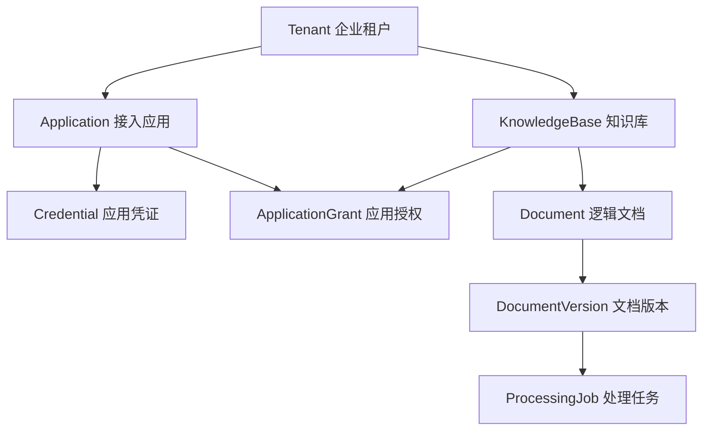
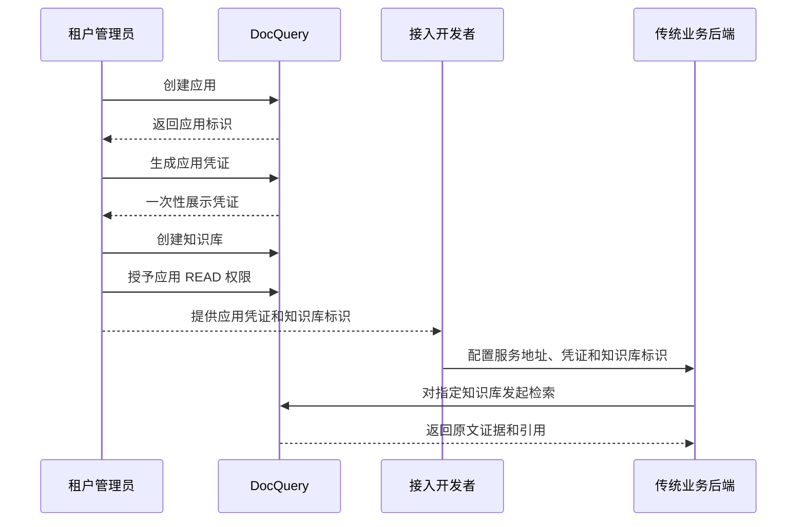

# DocQuery 产品设计 v0.1

> 文档状态：Draft  
> 产品版本：v0.1  
> 编写日期：2026-07-29  
> 适用范围：第一版 MVP 产品定义  
> 后续文档：管理后台页面说明、MVP 验收清单、正式外部契约、技术设计与重构路线

---

## 1. 文档目的

本文档回答以下产品问题：

- DocQuery 对外是什么产品
- 它为谁服务
- 谁是 DocQuery 的直接用户
- 传统业务系统与 DocQuery 的责任边界在哪里
- 第一版提供哪些功能
- 应用凭证如何访问知识库
- 文档、版本、任务和检索对外表现为何
- 最终需要交付什么
- 什么状态下可以认为 MVP 已经完成

本文档不冻结完整接口字段、数据库结构和内部技术实现。

接口细节允许随实现迭代，待 MVP 稳定后再整理正式外部契约。本文档只固定不应轻易变化的产品边界和核心行为。

---

## 2. 产品结论

DocQuery 第一版定义为：

> 面向已有业务系统的多租户知识库服务。DocQuery 通过管理面提供知识库和文档生命周期管理；传统业务后端通过应用凭证访问已授权知识库，获得带引用的原文检索和受控单轮问答能力。

DocQuery 不是：

- 面向普通消费者的聊天产品
- 企业用户中心
- 通用 Agent 平台
- 在线协作文档
- 通用工作流系统
- 普通网盘
- 只用于演示大模型调用的 RAG 页面

DocQuery 的核心价值不是“让用户和 PDF 聊天”，而是：

- 让传统业务系统不必重复开发文档处理和知识检索能力
- 让多个业务应用以稳定、隔离的方式访问企业知识库
- 让文档的上传、处理、更新、删除和版本切换具有清晰状态
- 让检索结果能够回到具体文档、版本和位置
- 让知识库服务可以被独立部署、管理和复用

---

## 3. 产品背景

### 3.1 目标问题

客服、工单、内容管理、企业 SOP、运维平台等传统业务系统，经常需要：

- 上传产品手册、规章制度和操作规范
- 根据业务问题检索内部资料
- 返回可验证的原文依据
- 在资料更新后及时切换到新版本
- 将知识能力接入现有业务页面

如果每个业务系统分别建设文档解析、分层检索地图、关键词与语义检索、原文阅读、引用和模型调用，会产生重复开发和维护成本。

DocQuery 将这些能力作为独立服务提供，业务系统只需要负责自己的业务用户和业务流程。

### 3.2 第一版锚点场景

第一版使用“设备企业售后工单系统”作为锚点场景。

示例企业：星云科技。

星云科技已有自己的：

- 工单系统
- 客服账号
- 销售账号
- 部门和角色
- 登录与业务权限

星云科技希望将产品手册、维修指南和售后规范接入工单系统，但不希望在工单系统内部重新开发完整知识库能力。

---

## 4. 目标客户与用户

### 4.1 目标客户

第一版目标客户是：

> 已有业务系统和用户体系，希望通过后端接口接入私有知识检索能力的企业或开发团队。

典型接入系统包括：

- 售后工单系统
- 客服工作台
- 企业内部管理系统
- 运维平台
- 内容管理系统
- 产品支持平台

### 4.2 DocQuery 直接用户

#### 平台管理员

负责部署后的租户管理和平台级运维。

主要任务：

- 创建或停用租户
- 处理平台级故障
- 查看平台运行状态

#### 租户管理员

代表某个企业管理其 DocQuery 空间。

主要任务：

- 管理租户信息
- 创建接入应用
- 生成、轮换和撤销应用凭证
- 创建知识库
- 将应用授权给知识库
- 查看租户级审计记录

#### 知识库管理员

负责维护具体知识库内容。

主要任务：

- 上传文档
- 查看处理状态
- 更新文档版本
- 删除或停用文档
- 处理失败任务
- 查看当前生效版本

#### 接入开发者

负责将传统业务系统接入 DocQuery。

主要任务：

- 获取应用凭证
- 配置知识库标识
- 调用检索能力
- 处理返回结果和引用
- 处理鉴权失败、限流和服务异常

#### 业务应用

业务应用是 DocQuery 服务面的机器调用者，例如：

- `work-order-production`
- `customer-service-production`
- `content-admin-production`

业务应用通过应用凭证访问已授权知识库。

### 4.3 非 DocQuery 用户

客服、销售、员工、终端客户等传统业务用户，不是 DocQuery 第一版直接管理的用户。

他们：

- 不在 DocQuery 注册账号
- 不向 DocQuery 同步部门和角色
- 不直接持有 DocQuery 应用凭证
- 不直接从浏览器调用 DocQuery

他们是否可以使用知识检索功能，由传统业务系统自行判断。

---

## 5. 产品责任边界

### 5.1 传统业务系统负责

- 终端用户注册、登录和注销
- 用户密码和账号安全
- 用户所属部门、岗位和业务角色
- 用户能否使用某个业务功能
- 用户能否查看某张工单、订单或客户
- 用户离职、禁用和权限变更
- 根据业务场景选择本次应查询的知识库
- 在自己的页面中展示检索或问答结果

### 5.2 DocQuery 负责

- 租户隔离
- 应用身份和应用凭证
- 知识库生命周期
- 应用到知识库的授权
- 文档和版本生命周期
- 文档处理状态
- 已授权知识库内的检索
- 检索结果引用
- 应用级访问审计
- 凭证轮换和撤销

### 5.3 明确接受的边界

如果传统业务系统错误地允许某个业务用户使用知识查询，并使用合法应用凭证调用 DocQuery，DocQuery 仍会返回结果。

这是产品边界，不是 DocQuery 的权限漏洞。

DocQuery 不理解：

- 工单负责人
- 客户归属
- 销售区域
- 员工职级
- 订单所有权
- 业务系统内部按钮权限

同样，如果业务应用选择了一个“已获授权但业务语义上不合适”的知识库，DocQuery 无法判断它是否选对。

DocQuery 只能保证：

> 应用不能访问未授权知识库。

传统业务系统负责保证：

> 当前业务请求选择了正确的知识库。

---

## 6. 核心资源模型

第一版核心资源关系为：



### 6.1 Tenant

Tenant 表示一个使用 DocQuery 的企业或组织。

要求：

- 所有应用、知识库和文档必须属于一个租户
- 一个租户不能发现或访问另一个租户的资源
- 租户身份由已验证的管理身份或应用凭证确定
- 服务面请求不能通过自行传入 `tenantId` 切换租户

### 6.2 Application

Application 表示一个接入 DocQuery 的传统业务系统或独立环境。

示例：

- `work-order-production`
- `work-order-testing`
- `customer-service-production`

要求：

- 生产和测试环境应使用不同应用
- 不同业务系统应使用不同应用
- 一个应用可以被授权访问多个知识库
- 一个知识库可以被多个应用访问

### 6.3 Credential

Credential 表示应用访问 DocQuery 服务面的凭证。

产品要求：

- 凭证创建后只展示一次完整秘密
- 凭证可以轮换
- 凭证可以撤销
- 凭证具有明确状态
- 凭证不能暴露给浏览器和终端用户
- 审计中能够识别使用了哪个应用和凭证
- 凭证泄露后的影响范围不能超过所属应用的授权范围

### 6.4 KnowledgeBase

KnowledgeBase 表示一个独立的知识集合。

示例：

- 售后维修知识库
- 产品参数知识库
- 运维知识库
- 企业制度知识库

一个知识库至少具有：

- 稳定标识
- 名称
- 描述
- 所属租户
- 启用状态
- 创建时间
- 更新信息

### 6.5 ApplicationGrant

ApplicationGrant 表示“某个应用可以对某个知识库执行哪些操作”。

应用权限范围：

- `READ`：检索、查看允许公开给应用的文档信息、使用受控单轮问答
- `WRITE`：上传、更新和删除文档
- `READ_WRITE`：同时拥有 `READ` 和 `WRITE`

数据库和接口使用字符串数字代码：`"1"` = `READ`、`"2"` = `WRITE`、`"3"` = `READ_WRITE`。这些值是普通枚举代码，不是位掩码。知识库配置和应用授权仍由租户管理员通过管理面完成，不向应用凭证提供 `ADMIN` 权限。第一版先实现 READ/WRITE 授权模型；应用凭证实际调用文档写入接口要等文档生命周期接口正式设计后开放。

第一版遵循：

- 默认无权限
- 必须显式授权
- 一次服务面请求只访问一个明确知识库
- 应用凭证不是租户级万能凭证
- 不实现最终用户、部门和用户组级授权

### 6.6 Document

Document 表示一个长期存在的逻辑文档。

例如：

```text
S1设备维修手册
```

文件内容更新时，不创建一个完全无关的新逻辑文档，而是在该 Document 下创建新版本。

### 6.7 DocumentVersion

DocumentVersion 表示文档某次上传的具体内容。

例如：

```text
S1设备维修手册
├─ v1
├─ v2 当前生效
└─ v3 处理中
```

一个 Document 同一时间只能有一个生效版本参与检索。

### 6.8 ProcessingJob

ProcessingJob 表示一次文档处理任务。

它用于对外回答：

- 是否仍在处理
- 是否已经成功
- 是否失败
- 失败原因是什么
- 是否可以重试
- 当前处理的是哪个文档版本

---

## 7. 产品形态

DocQuery 第一版由四个对外交付面组成。

### 7.1 管理后台

供平台管理员、租户管理员和知识库管理员使用。

管理后台负责：

- 租户和管理员操作
- 应用管理
- 凭证管理
- 知识库管理
- 应用授权
- 文档和版本管理
- 任务状态
- 访问审计

### 7.2 管理 API

供自动化管理或后续客户端使用。

能力范围：

- 应用和凭证管理
- 知识库管理
- 应用授权管理
- 文档管理
- 任务查询和重试

完整字段和接口形式不在本文档中冻结。

### 7.3 服务 API

供传统业务后端调用。

第一版核心能力：

- 对指定知识库执行关键词与语义导航双路检索
- 返回可追溯的原文证据和引用
- 基于已授权原文证据执行受控的单轮问答

第一版不允许普通浏览器直接持有应用凭证调用服务 API。

### 7.4 接入示例

提供一个小型售后工单系统 Demo，用于证明：

- 传统业务系统可以接入 DocQuery
- 业务系统可以自行管理终端用户
- 业务系统能够选择目标知识库
- 已授权应用可以获得检索结果
- 未授权应用会被拒绝
- 引用可以显示在业务页面

---

## 8. 产品功能设计

### 8.1 租户管理

第一版支持：

- 创建租户
- 查看租户信息
- 启用或停用租户
- 查看租户下应用和知识库概览

第一版不包含：

- 在线付费
- 套餐购买
- 复杂组织架构
- 跨租户共享

### 8.2 应用管理

租户管理员可以：

- 创建应用
- 设置应用名称和描述
- 区分生产、测试等环境
- 查看应用当前授权的知识库
- 停用应用
- 删除不再使用的应用

应用停用后，其所有凭证均不能继续访问服务面。

### 8.3 凭证管理

租户管理员可以：

- 为应用生成凭证
- 查看凭证摘要和创建时间
- 查看最后使用时间
- 轮换凭证
- 撤销凭证

创建凭证时必须明确提示：

> 完整凭证只展示一次，请保存在业务后端的安全配置中，不要提交到代码仓库或发送给浏览器。

### 8.4 知识库管理

租户管理员或具有管理权限的管理员可以：

- 创建知识库
- 修改知识库名称和描述
- 启用或停用知识库
- 查看知识库包含的文档
- 查看知识库授权了哪些应用
- 删除空知识库

知识库停用后：

- 服务面不再返回该知识库内容
- 已有文档和版本暂时保留
- 管理员可以重新启用

### 8.5 应用授权管理

管理员可以从两个方向管理授权：

#### 从应用查看

```text
工单系统-production
├─ 售后知识库    READ
└─ 产品知识库    READ
```

#### 从知识库查看

```text
售后知识库
├─ 工单系统-production    READ
└─ 产品支持系统           READ
```

支持：

- 新增授权
- 修改权限范围
- 撤销授权
- 查看授权时间和操作人

授权被撤销后，应用不能继续对该知识库发起新的服务面访问。

### 8.6 文档上传

知识库管理员可以：

- 选择目标知识库
- 上传支持的文档
- 填写或确认文档名称
- 查看上传和处理状态

上传受理后，对外至少返回：

- 文档标识
- 版本标识
- 任务标识
- 当前状态

第一版计划支持的主要格式：

- PDF
- DOCX
- TXT
- Markdown

PDF 第一版只支持能够提取文本的文件，不支持扫描件 OCR、图片语义理解和复杂版面恢复。文档检索地图只采用文件中真实存在且能够可靠解析的标题，不由模型生成虚拟目录。实际文件大小上限和更细格式边界在完成基线测试后确定。

### 8.7 文档状态

管理后台需要用少量、容易理解的外部状态展示处理结果：

- 处理中（`PROCESSING`）：文档正在处理，尚不可检索
- 可检索（`READY`）：文档版本已经处理完成，可以参与检索
- 处理失败（`FAILED`）：可以查看原因并重试
- 删除中（`DELETING`）：已经停止参与检索，正在清理
- 已删除（`DELETED`）：删除完成

内部可以有更多技术阶段，但不要求全部暴露给普通管理员。

### 8.8 文档更新与版本

上传同一逻辑文档的新内容时，创建新版本。

第一版默认行为：

1. 旧版本继续参与检索。
2. 新版本进入 `PROCESSING`。
3. 新版本处理成功后自动成为生效版本。
4. 旧版本不再参与新检索，但保留版本记录。
5. 新版本失败时，旧版本继续生效。

第一版不要求管理员手动审核后再激活版本。

手动激活和版本回滚可作为后续功能。

### 8.9 文档删除

删除文档后：

- 文档应首先停止参与新的检索
- 管理后台显示删除进度
- 后台清理完成后显示 `DELETED`
- 删除失败不能让文档重新出现在检索结果中

是否支持删除后的恢复，第一版不承诺。

### 8.10 失败重试

管理员可以对失败任务执行重试。

产品要求：

- 显示可理解的失败摘要
- 保留原任务和尝试记录
- 重试不会创建重复文档
- 重试成功后版本可以正常生效

### 8.11 带引用的双路检索

带引用检索是第一版核心服务能力。检索不是固定 Chunk Top-K，而是两条并行的定位通道：

```text
关键词通道：在真实原文中定位文档、标题和页码
向量通道：在文档和真实章节检索卡中定位语义相关地址
→ 融合两路排名
→ 返回原文证据
```

业务应用提交：

- 应用凭证
- 目标知识库
- 查询文本
- `Idempotency-Key`
- 可选检索参数

DocQuery 返回：

- 原文证据
- 文档名称和标识
- 文档版本
- 真实标题路径
- 页码、段落、行号或其他可用位置
- 关键词高亮
- 关键词、语义或双路命中信息
- 可供业务系统展示的引用信息
- 完整检索或明确降级状态

产品要求：

- 先验证应用凭证和 KnowledgeBase Grant，再执行两路检索
- 只检索指定知识库
- 只检索当前生效版本
- 只检索可用状态的文档
- 未授权应用不能发现知识库内容
- 检索卡只用于导航，不能作为最终答案依据
- 没有相关原文时返回正常空结果，不伪造答案
- Embedding 查询不可用时允许明确降级为关键词检索，不能声称已经执行完整双路检索

### 8.12 受控单轮问答

第一版提供独立于检索接口的单轮问答能力。它不是通用 Agent 平台，也不提供多轮聊天记忆。

问答通过少量只读工具完成：

```text
搜索文档
→ 查看真实目录
→ 在指定文档内继续搜索
→ 按页码或其他位置读取原文
→ 证据充分后回答
```

问答结果至少包含：

- 回答内容
- 原文引用列表
- 完成、无充分证据或失败状态
- 查询执行标识
- 检索降级信息

产品要求：

- 问答建立在已授权知识库和当前生效版本之上
- KnowledgeBase、tenant 和 application 上下文由服务端固定，模型不能切换
- 限制工具轮数、读取范围和上下文预算
- 文档正文视为不可信数据，不能执行其中包含的指令
- 模型不可用时明确返回生成失败
- 生成失败不能被伪装成“没有相关文档”
- 检索接口必须能够独立使用
- 不要求接入方必须使用 DocQuery 问答
- 第一版不承诺流式输出和多轮对话

### 8.13 应用级访问审计

第一版审计主体是业务应用，不是传统业务终端用户。

审计至少记录：

- 租户
- 应用
- 使用的凭证标识摘要
- 目标知识库
- 操作类型
- 请求追踪标识
- 查询执行标识
- 时间
- 成功或失败
- 失败原因分类

业务系统可以额外传递不透明的 `actorRef` 或 `traceId` 用于联合排查。

该字段只用于审计和定位，不参与 DocQuery 权限判断，也不被 DocQuery 视为可信用户身份。

---

## 9. 应用访问知识库的规则

### 9.1 目标知识库由调用方明确指定

DocQuery 不根据问题内容猜测应该查询哪个知识库。

传统业务系统根据自己的业务场景选择目标知识库，例如：

```text
售后故障查询 → 售后知识库
产品参数查询 → 产品知识库
```

### 9.2 DocQuery 验证应用授权

一次服务面访问的判断逻辑在产品层表现为：

```text
应用凭证是否有效
→ 应用是否启用
→ 目标知识库是否属于同一租户
→ 知识库是否启用
→ 应用是否拥有所需权限
→ 允许或拒绝
```

### 9.3 一次请求只访问一个知识库

第一版不支持：

- 自动查询租户下所有知识库
- 一次请求混合多个知识库
- 根据自然语言自动路由到任意知识库

如果以后增加多知识库查询，必须对每个知识库分别验证应用授权。

### 9.4 资源存在性保护

未授权应用不应通过服务面获知其他知识库的名称、文档列表或内容。

“资源不存在”和“无权访问”在服务面是否使用相同外部错误表现，留待正式外部契约确定。

### 9.5 凭证泄露的影响边界

如果应用凭证泄露，攻击者可能访问该应用已经获得授权的知识库。

DocQuery 第一版需要把影响范围限制在：

- 该凭证所属应用
- 该应用所属租户
- 该应用已授权知识库
- 该授权允许的操作

因此：

- 不提供所有租户共用凭证
- 不建议一个租户下所有业务系统共用凭证
- 生产和测试环境不共用凭证

---

## 10. 核心用户流程

### 10.1 首次接入



### 10.2 文档首次入库

```text
知识库管理员打开目标知识库
→ 上传文档
→ 获得文档、版本和任务标识
→ 页面显示PROCESSING
→ 处理成功后显示READY
→ 当前版本开始参与检索
```

### 10.3 文档更新

```text
管理员为已有文档上传新版本
→ 旧版本继续提供检索
→ 新版本显示PROCESSING
→ 新版本成功后自动切换
→ 新检索引用新版本
```

失败时：

```text
新版本显示FAILED
→ 展示失败摘要
→ 旧版本继续提供检索
→ 管理员可以重试
```

### 10.4 业务系统检索

```text
业务用户在工单系统触发知识查询
→ 工单系统判断该用户是否可以使用该功能
→ 工单系统选择售后知识库
→ 工单后端携带应用凭证调用DocQuery
→ DocQuery验证应用与知识库授权
→ 返回原文证据，或执行单轮问答并返回引用
→ 工单系统展示证据或回答
```

### 10.5 未授权应用访问

```text
未授权应用指定售后知识库
→ DocQuery验证应用授权失败
→ 不返回知识库内容
→ 记录失败审计
```

### 10.6 凭证轮换

```text
租户管理员生成新凭证
→ 业务系统更新配置
→ 验证新凭证可用
→ 撤销旧凭证
→ 旧凭证无法继续访问
```

---

## 11. 管理后台信息架构

第一版管理后台建议包含以下页面。

### 11.1 管理员登录

- 管理员登录
- 当前租户切换或显示

第一版管理后台账号只服务少量 DocQuery 管理人员，不同步传统业务系统的全部终端用户。

第一版使用本地管理员账号和服务端 Session。首个平台管理员由部署人员通过一次性交互命令创建，不在管理后台提供初始化页面或注册入口。

后续可以通过 OIDC 接入企业 SSO，但不作为第一版阻塞项。

### 11.2 租户概览

展示：

- 应用数量
- 知识库数量
- 文档数量
- 处理中任务
- 失败任务
- 最近访问情况

### 11.3 应用管理

展示：

- 应用名称
- 环境
- 状态
- 凭证数量
- 已授权知识库
- 最近调用时间

主要操作：

- 创建应用
- 停用应用
- 生成凭证
- 轮换凭证
- 撤销凭证
- 管理知识库授权

### 11.4 知识库列表

展示：

- 名称
- 状态
- 文档数量
- 已授权应用数量
- 最近更新时间

主要操作：

- 创建知识库
- 修改信息
- 启用或停用
- 进入知识库详情

### 11.5 知识库详情

包含：

- 基本信息
- 文档列表
- 应用授权
- 处理任务
- 访问审计

### 11.6 文档与版本

展示：

- 文档名称
- 当前生效版本
- 最新版本状态
- 更新时间
- 失败摘要

主要操作：

- 上传文档
- 上传新版本
- 查看版本历史
- 重试失败版本
- 删除文档

### 11.7 应用授权

展示：

- 应用
- 知识库
- 权限范围
- 授权时间
- 操作人

主要操作：

- 新增授权
- 修改授权
- 撤销授权

### 11.8 访问审计

支持按以下条件查看：

- 时间
- 应用
- 知识库
- 操作
- 成功或失败
- 请求追踪标识

### 11.9 必须考虑的界面状态

生成管理后台草图时，不能只设计正常状态，还应覆盖：

- 首次使用的空状态
- 加载中
- 上传中
- 文档处理中
- 处理失败
- 删除中
- 凭证只展示一次
- 撤销凭证确认
- 未授权
- 服务暂时不可用

---

## 12. 对外生命周期与异常行为

### 12.1 文档尚未就绪

`PROCESSING` 版本不能参与检索。

如果文档没有任何 `READY` 版本，查询结果中不能出现该文档。

### 12.2 新版本处理失败

- 失败版本不参与检索
- 旧生效版本继续使用
- 管理后台显示失败原因
- 管理员可以重试

### 12.3 知识库被停用

- 新服务面查询被拒绝
- 知识库数据保留
- 管理员可以重新启用

### 12.4 应用被停用

- 所有凭证停止工作
- 历史授权和审计保留

### 12.5 凭证被撤销

- 被撤销凭证不能发起新访问
- 同一应用的其他有效凭证不受影响

### 12.6 没有相关内容

检索成功但没有相关原文证据时，应返回空结果和清晰状态。

不能为了“看起来有答案”而生成没有来源支持的内容。

### 12.7 模型不可用

如果单轮问答使用的模型不可用：

- 明确返回问答失败
- 不伪装成检索无结果
- 独立检索能力仍应可以使用；查询改写失败时使用原问题，Embedding 查询失败时明确降级为关键词检索

### 12.8 处理服务中断

如果文档处理暂时中断：

- 管理后台能够看到任务尚未成功
- 已有生效文档继续可检索
- 服务恢复后任务可以继续或安全重试
- 不因重复处理产生多个相同生效版本

---

## 13. 产品级非功能要求

### 13.1 安全

- 应用凭证不能以明文长期展示
- 凭证不能写入示例配置和日志
- 租户身份不能由调用方任意指定
- 所有知识库访问都必须验证应用授权
- 默认无权限
- 管理操作和服务访问需要审计
- 当前仓库中已有或疑似暴露的秘密必须先轮换

### 13.2 可靠性

- 文档处理失败不能让错误版本参与检索
- 新版本失败不能中断旧版本服务
- 重试不能产生重复生效内容
- 删除后不能因清理失败重新被检索
- 服务面与后台任务故障应尽量隔离

### 13.3 可用性

- 管理员能理解文档当前状态
- 失败状态提供可执行的下一步
- 凭证创建、轮换和撤销流程清晰
- 接入开发者能够快速找到知识库标识和授权状态

### 13.4 可观测性

管理员和开发者能够回答：

- 哪个应用访问了哪个知识库
- 某次请求是否成功
- 某个文档为什么没有进入检索
- 某个版本当前是什么状态
- 某个失败任务是否已经重试

### 13.5 兼容性

正式对外发布后：

- 公开接口需要具有版本标识
- 不随意修改已有字段语义
- 破坏性变化需要明确升级说明

完整版本兼容策略在 MVP 稳定后写入正式外部契约。

---

## 14. MVP 范围

### 14.1 P0：产品成立所必需

- 基础管理身份
- 租户管理
- 应用管理
- 应用凭证创建、撤销和轮换
- 知识库创建、启用和停用
- 应用到知识库的 `READ`、`WRITE` 或 `READ_WRITE` 授权
- 文档上传
- 文档处理状态
- 文档版本
- 新版本成功后切换
- 新版本失败时旧版本继续可用
- 删除文档并立即停止检索
- 对单个指定知识库执行带引用检索
- 对单个指定知识库执行受控单轮问答
- 通过 `Idempotency-Key` 避免相同应用的昂贵查询被并发重复执行，并在短时间内复用结果
- 未授权应用访问拒绝
- 跨租户隔离
- 应用级访问审计
- 售后工单接入 Demo

### 14.2 P1：MVP 后优先增加

- 业务应用使用 `WRITE` 权限进行程序化文档同步
- 流式问答和多轮会话
- Java Client
- Spring Boot Starter
- 管理员企业 SSO
- 回调或 Webhook 通知任务完成
- 手动切换和回滚文档版本
- 配额和调用限流配置
- 更完整的审计检索

### 14.3 P2：长期候选

- 多知识库查询
- 知识库路由
- MCP 和外部 Agent 只读访问接口
- Agent 生成 Wiki 草稿
- 来源冲突和过期检测
- 外部文档源同步
- 文档级受限访问
- 跨租户知识发布

### 14.4 第一版明确不做

- 传统业务终端用户管理
- 业务用户级和部门级权限
- 工单、订单和客户数据权限
- 浏览器直接持有应用凭证
- 通用 Agent 工作流
- 模型生成虚拟目录
- 扫描件 OCR 和复杂版面理解
- 固定长度 Chunk、Overlap 和独立向量数据库
- 富文本协作文档
- 任意段落级 ACL
- 一次查询租户下全部知识库
- 在线计费和商业套餐
- 多厂商能力市场

---

## 15. MVP 验收故事

### 15.1 场景准备

创建两个租户：

- 星云科技
- 海岳设备

星云科技创建：

- 应用：`work-order-production`
- 应用：`crm-production`
- 知识库：售后维修知识库
- 知识库：产品参数知识库

授权：

```text
work-order-production
├─ 售后维修知识库    READ
└─ 产品参数知识库    READ

crm-production
└─ 不授予售后维修知识库权限
```

### 15.2 正常流程

1. 知识库管理员上传《S1设备维修手册》。
2. 页面显示“处理中（`PROCESSING`）”。
3. 处理完成后显示“可检索（`READY`）”。
4. 工单系统使用自己的应用凭证查询售后维修知识库。
5. DocQuery 返回与 E03 故障相关的原文证据。
6. 返回结果来自原文关键词检索或检索卡语义导航，并包含文档名称、版本和位置引用。
7. 工单系统可以展示原文证据，或调用单轮问答并展示带引用答案。

### 15.3 授权验证

- 未绑定售后知识库的应用查询时被拒绝。
- 星云科技应用不能访问海岳设备知识库。
- 调用方不能通过伪造租户标识绕过隔离。
- 撤销应用凭证后，该凭证不能继续访问。
- 应用选择一个已授权知识库时可以查询其全部可用内容，DocQuery 不再判断传统业务用户身份。

### 15.4 版本验证

1. 管理员上传《S1设备维修手册》v2。
2. v2 处理期间，v1 继续参与检索。
3. 模拟 v2 处理失败，v1 仍可查询。
4. 重试 v2 并成功。
5. 新查询引用 v2。
6. v1 不再参与新查询，但版本记录仍然存在。

### 15.5 删除验证

1. 管理员删除某个文档。
2. 文档立即不再参与新查询。
3. 页面显示 `DELETING`。
4. 清理完成后显示 `DELETED`。

### 15.6 审计验证

管理员可以看到：

- 哪个应用查询了哪个知识库
- 调用时间
- 成功或失败
- 请求追踪标识
- 凭证撤销和授权变更记录

---

## 16. 产品成功指标

第一版先定义指标和测量方式，不在没有基线的情况下承诺夸张数值。

### 16.1 接入成功

- 新接入开发者能够根据说明完成应用创建、知识库授权和首次查询
- 接入过程不要求同步传统业务用户
- 接入方不需要了解 DocQuery 内部存储和消息系统

### 16.2 功能正确

- 已授权应用能够查询指定知识库
- 未授权和跨租户访问测试全部拒绝
- 检索结果可以追溯到文档版本和位置
- 文档更新和删除符合约定生命周期

### 16.3 可靠性

- 重复任务不会产生重复生效内容
- 处理中断后可以恢复或安全重试
- 新版本失败不会影响旧版本
- 凭证撤销和授权撤销按约定生效

### 16.4 检索效果

建立一个可复现的小型评测集，记录：

- 测试文档
- 测试问题
- 相关文档、真实章节和原文位置标注
- Recall@5
- Recall@10
- MRR
- 引用正确率
- 查询延迟

评测需要分别记录关键词单路、向量导航单路和融合结果，不能只报告最终最佳数字。具体目标值在建立基线后确定并记录，不能使用没有实测依据的宣传数字。

### 16.5 性能与容量

压测报告至少记录：

- 测试机器和运行环境
- 文档、原文位置记录与检索节点规模
- 并发数
- 吞吐量
- P50、P95、P99
- 错误率
- 后台处理实例数量

---

## 17. MVP 最终交付物

第一版完成时应交付：

### 产品材料

- 产品设计文档
- 管理后台页面说明
- 管理后台草图
- MVP 验收清单
- 演示脚本

### 对外材料

- OpenAPI 文档
- 应用凭证使用说明
- 接入示例
- 错误码和状态说明
- 正式外部契约 v1

### 软件

- 可部署的 DocQuery 服务
- 管理后台
- 售后工单接入 Demo
- 数据库迁移脚本
- 本地或测试环境启动方式

### 质量证据

- 功能测试
- 租户与应用授权测试
- 文档版本测试
- 重复处理测试
- Outbox、RabbitMQ 重试和死信测试
- Redis 查询幂等测试
- 故障恢复测试
- 检索评测报告
- 压测报告

---

## 18. 推荐实施顺序

### 阶段 A：产品材料

1. 评审本文档。
2. 冻结产品定位和权限边界。
3. 编写管理后台页面说明。
4. 生成管理后台草图。
5. 建立 MVP 验收清单。

### 阶段 B：最小完整链路

```text
创建租户
→ 创建应用和凭证
→ 创建知识库
→ 给应用授权READ
→ 上传一个文档
→ 文档变为READY
→ 已授权应用查询成功
→ 已授权应用获得原文证据或带引用单轮答案
→ 未授权应用查询失败
→ 返回来源引用
```

### 阶段 C：生命周期

- 文档更新
- 版本切换
- 失败重试
- 删除
- 应用停用
- 凭证轮换和撤销

### 阶段 D：可靠性与交付

- 异常恢复
- 重复处理
- 审计
- 指标
- 压测
- 接入 Demo
- 正式外部契约

---

## 19. 待确认但不阻塞产品定义的问题

以下问题允许在实现和草图阶段继续收敛：

- 服务面无权限资源最终返回 `403` 还是隐藏为 `404`
- 首批文件格式和大小上限
- Chat Model 和 Embedding Model 验收基线
- Embedding 维度和 ES 索引重建策略
- Redis 幂等结果 TTL
- RabbitMQ 重试、退避和死信运维规则
- 任务完成是否需要 Webhook
- 应用是否允许同时保留多个有效凭证
- 凭证轮换的重叠窗口
- 文档删除是否支持恢复
- 第一版是否提供 Java Client

这些问题的调整不能破坏已经确认的核心边界：

> 传统业务系统管理终端用户；DocQuery 管理应用身份、租户隔离和应用到知识库的授权。

---

## 20. 产品变更原则

个人开发允许产品想法变化，但变化必须被记录。

建议每次重要变更记录：

- 变更了什么
- 为什么变更
- 影响哪些用户流程
- 是否影响已有数据
- 是否影响公开接口
- 是否需要迁移或兼容

在 MVP 发布前，本文档可以持续更新为 `v0.x`。

正式发布后，破坏外部行为的变化应通过新版本处理，不能只修改代码而不说明。

---

## 21. 一句话演示

> 管理员为工单系统创建应用凭证，将它授权给售后知识库并上传维修手册；工单系统随后可以通过关键词与检索卡语义导航找到原文，并获得带文档版本和位置引用的证据或单轮答案，未授权应用和其他租户无法访问。

当这条流程可部署、可演示、可验证时，DocQuery 第一版产品才真正成立。
