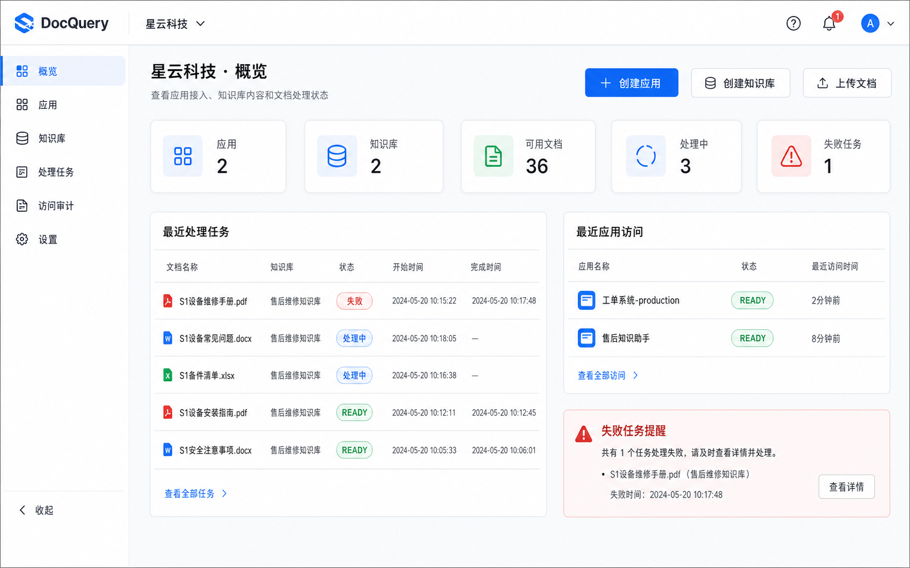
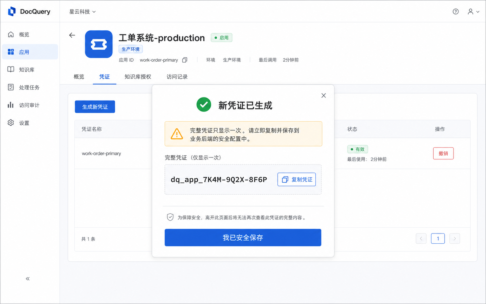
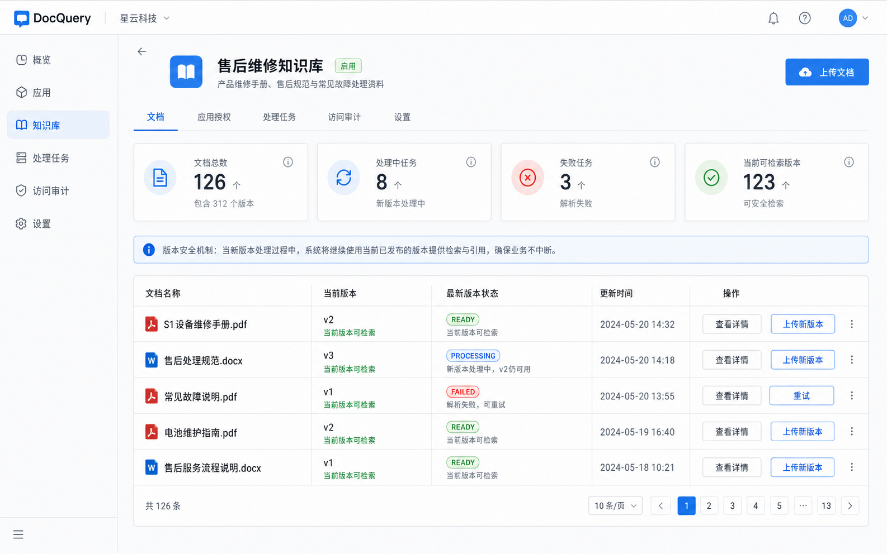
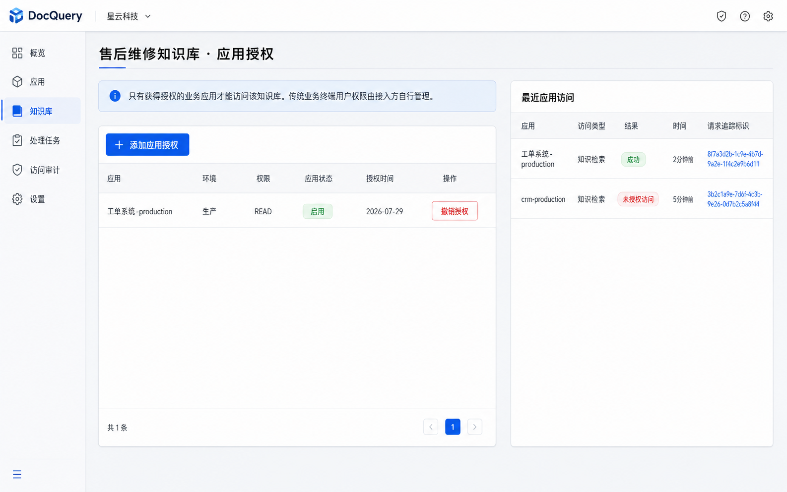

# DocQuery 管理后台草图

> 生成日期：2026-07-29  
> 生成方式：内置 ImageGen  
> 用途：产品视觉参考，不是最终可交付前端设计稿

## 草图索引

### 1. 租户概览

文件：[01-租户概览.png](./01-租户概览.png)



重点表现：

- 当前租户始终可见
- 应用、知识库、文档和任务指标
- 最近处理任务
- 最近应用访问
- 失败任务提醒

### 2. 应用详情与凭证

文件：[02-应用详情与凭证.png](./02-应用详情与凭证.png)



重点表现：

- 应用与生产环境标识
- 应用凭证列表
- 完整凭证只在创建弹窗展示一次
- 复制和确认安全保存
- 撤销入口

### 3. 知识库详情与文档版本

文件：[03-知识库详情与文档版本.png](./03-知识库详情与文档版本.png)



重点表现：

- 当前知识库和启用状态
- 文档、处理中和失败任务概览
- 当前版本与最新版本状态
- 新版本处理中时旧版本仍可用
- 失败重试和上传新版本

### 4. 应用授权与访问审计

文件：[04-应用授权与访问审计.png](./04-应用授权与访问审计.png)



重点表现：

- 权限主体只有业务应用
- MVP 权限支持 `READ`、`WRITE` 和 `READ_WRITE`，草图中的 `READ` 仅为示例
- 传统业务终端用户权限由接入方管理
- 成功和未授权访问都记录应用级审计
- 不出现用户、部门和用户组授权

## 统一提示词规范

四张草图均使用以下统一视觉提示：

```text
Use case: ui-mockup
Asset type: high-fidelity desktop enterprise SaaS admin screen
Style/medium: realistic shippable Chinese enterprise SaaS product UI
Composition: 16:10 landscape, full desktop screen, left navigation and compact top bar
Color palette: cool blue primary, white cards, light-gray dividers
Status colors: green success, blue processing, orange warning, red failure, gray deleting or disabled
Constraints: readable simplified Chinese; application-level authorization only;
no business end-user, department, group, OWNER, EDITOR or VIEWER permissions;
no chat UI; no illustrations; no photos; no third-party logos; no watermark
```

各页面分别追加：

1. 租户概览：指标卡、最近处理任务、最近应用访问和失败提醒。
2. 应用详情：凭证页签和一次性完整凭证弹窗。
3. 知识库详情：文档表格、当前版本、最新版本状态和版本安全说明。
4. 应用授权：应用级 `READ` 授权表和最近应用访问审计。

## 使用限制

- 草图中的数量、日期、请求追踪标识和示例文件是视觉占位数据。
- 草图不能代替页面说明中的状态、操作和异常约束。
- 生图可能对小字号文字、分页数字或图标细节进行近似渲染。
- 后续前端实现应使用真实设计系统和可访问组件重新构建。
- 如草图与产品设计文档冲突，以产品设计文档为准。
